# Basic File Manipulation

## file command 

The file command runs tests/checks on a file to try to determine what type of file and what type of data it holds

### Basic Usage

#### Setup

```
touch test1
echo "This is an ascii text file" > test2
echo -e "#include <stdio.h>\n\nint main(){}\n" > test3
mkdir test4
ln test1 test5
ln -s test1 test6
mkfifo test7
```

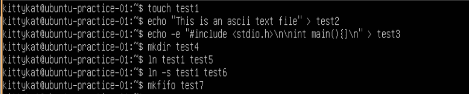

#### File Command Basic Usage

```
ls
file test1
file test*
file /dev/dm-0
shred test2
file test2
```

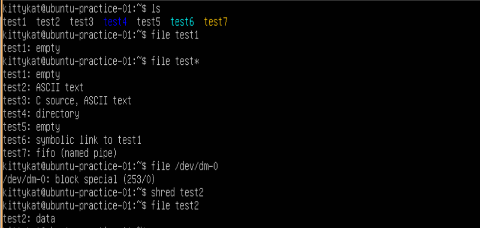

## stat 

### Display File and Directory Statistics

```
stat test1
stat test2
stat test3
stat test4
```

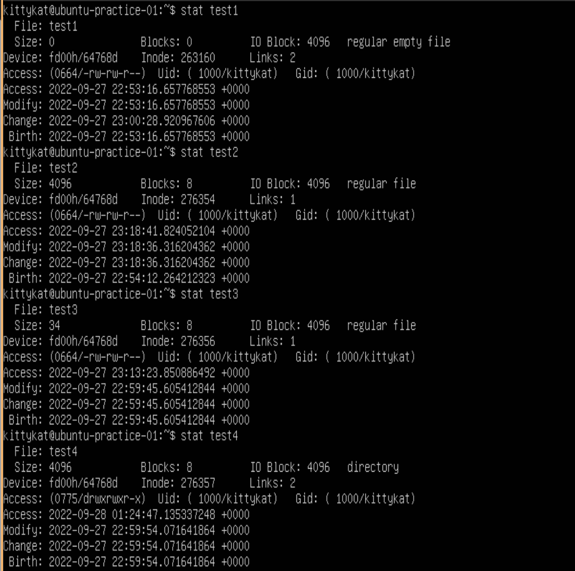

```
stat test5
stat test6
stat test7
```

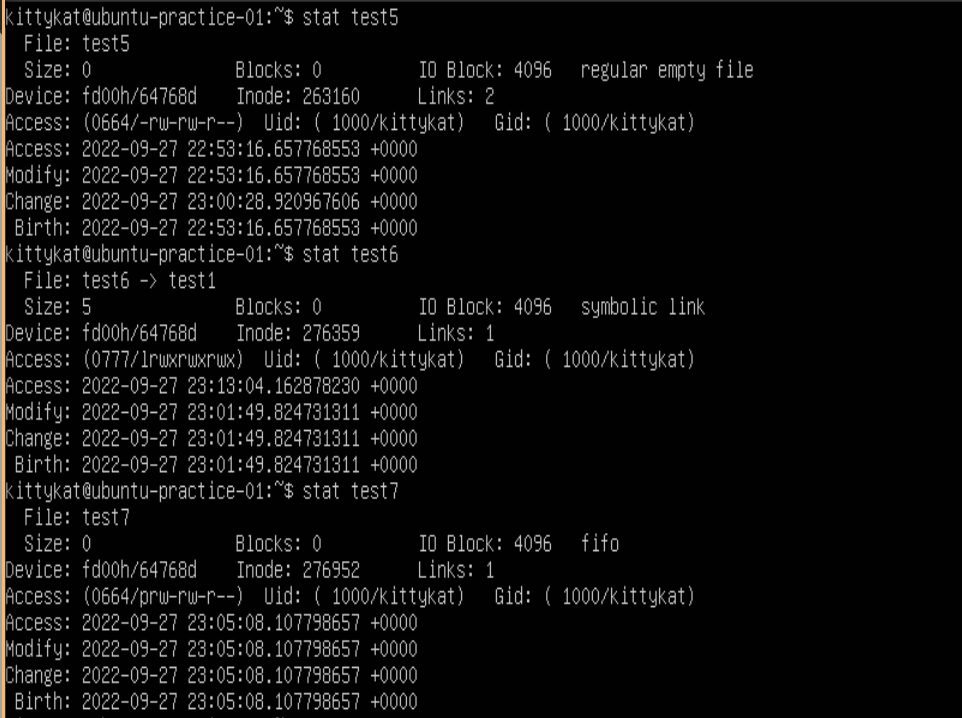

## cp

### Basic copy command

```
ls
cat test3
cp test3 new_test3
ls
cat new_test3
```

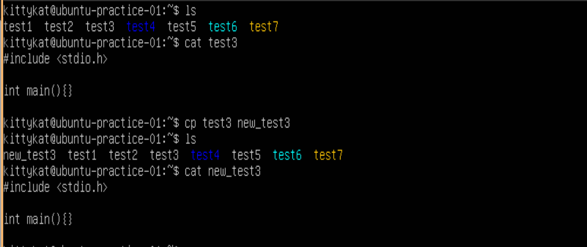

### Copy with prompting before clobber and no clobber

```
ls
cp -i test1 test3
n
cat test3
cp -n test1 test3
cat test3
ls
cp -b test1 test3
ls
cat test3
cat test3~
```

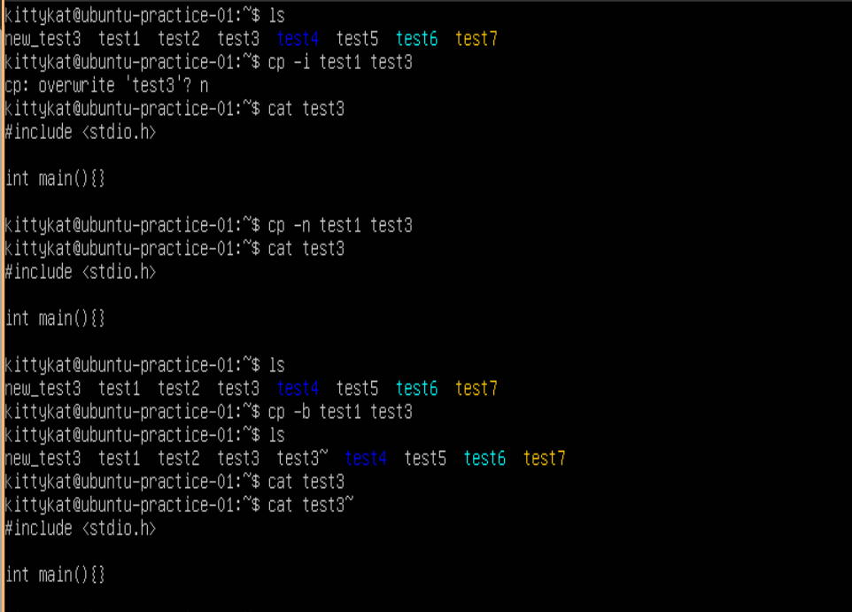

## mv

### basic mv command to rename a file/directory

```
ls
mv test4 test_dir
ls 
mv new_test3 test3_copy
ls
```

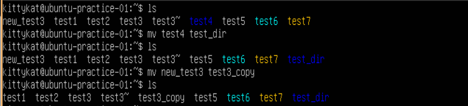

### basic mv command to relocate a file


```
ls
mv test3_copy test_dir/
mv test3~ test_dir/
ls
ls test_dir
```

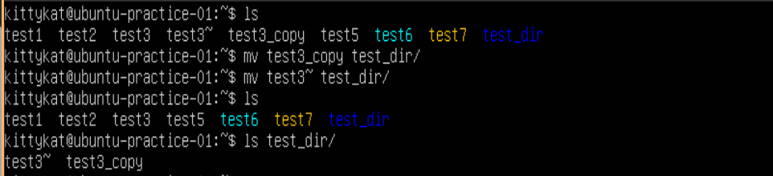

### mv command without clobbering

```
ls
mv -i test1 test2
n
ls
mv -n test1 test2
ls
mv -b test1 test2
ls
```

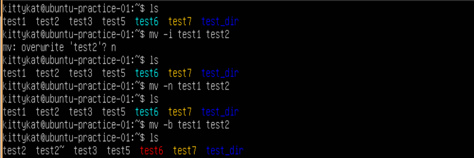

Notice the symbolic link of test6 to test1 is now broken.
use `ls -l` to see this more clearly.

### move and rename

```
ls
mv test2~ test_dir/backup_test2
ls
ls test_dir
```

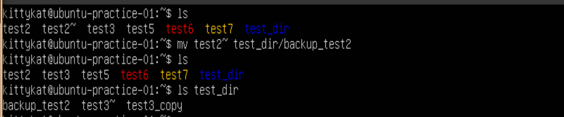


## touch command

### Create and new empty file

```
ls 
touch test1
file test1
stat test1
cat test1
```


notice that the symbolic link from test6 to test1 in fixed `ls -l`

### Update the timestamps

```
ls
stat test1
touch test1
stat test1
```


## Display file Contents

### Setup

```
ls
for i in {1..1000}; do echo "this is line number $i" >> test1; done
for i in {1..5}; do echo "file1 line $i" >> file1.txt; done
for i in {1..5}; do echo "file2 line $i" >> file2.txt; done
ls
```

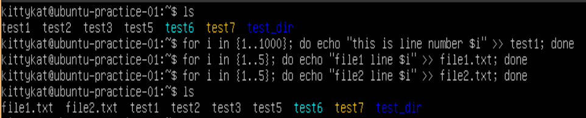

### cat command

```
ls
cat file1.txt
cat file1.txt file2.txt
cat file1.txt file2.txt > file3.txt
cat file3.txt
ls
```

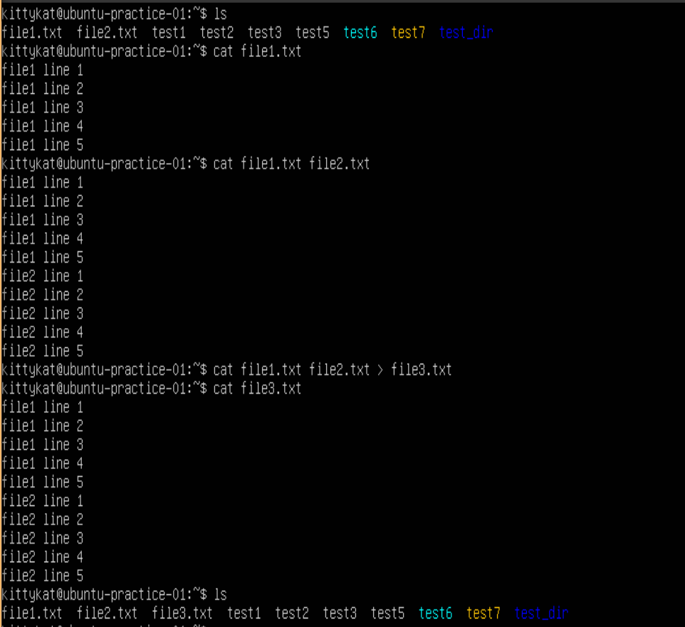

### head command

Display the first lines of a file

```
ls
head test1
head -n 15 test1
```

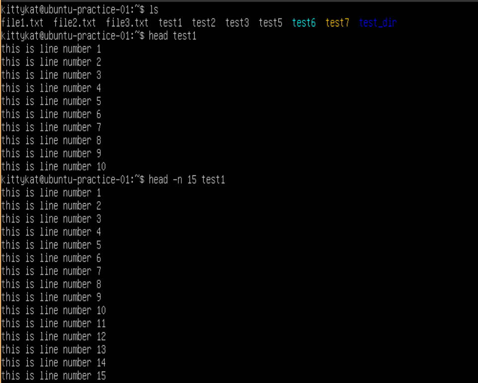

### tail command

Display the last lines of a file

```
ls
tail test1
tail -n 15 test1
```

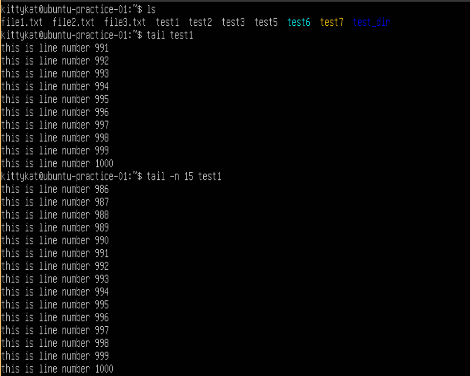


Follow a file (good for logs)

```
tail -f /var/log/syslog
^C
```

### less is more

#### more command

```
more test1
RETURN
RETURN
SPACE
B-KEY
B-KEY
Q-KEY
```

#### less command

```
less
RETURN
RETURN
SPACE
SPACE
J-KEY
J-KEY
K-KEY
K-KEY
B-KEY
B-KEY
Q-KEY
```

## rm command

### Prep

```
mkdir dir1
mkdir dir2
```

### Removing files and directories

```
ls
rm file1.txt
rm -i file2.txt
y
ls
rm -d dir1
rmdir dir2
ls
rm -I file3.txt
rm -I test?
y
ls
rm -d test_dir/
rmdir test_dir/
rm -r test_dir/
ls
```

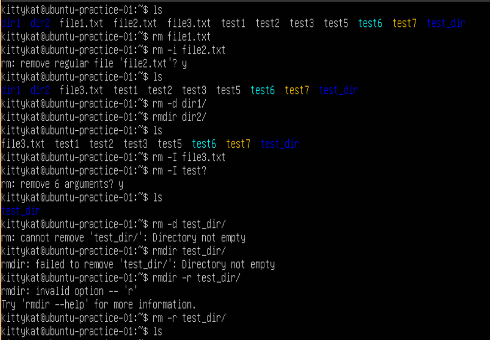

# References

1) man pages


