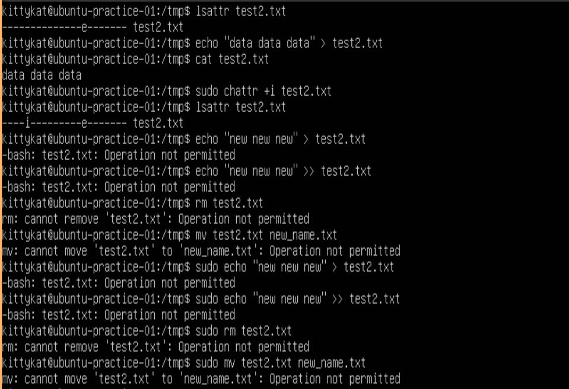

# File Attributes and ACLs

## Initial setup

```
umask 0066
cd /tmp
touch test{1..5}.txt
mkdir dir1
touch dir1/file{1..5}.txt
sudo useradd -m -s /bin/bash user1
grep "user1" /etc/passwd
ls -l
ls -l dir1/
```


## File Attributes

### List File Attributes

```
lsattr 
lsattr test1.txt
lsattr dir1
lsattr -v test1.txt
lsattr -d dir1
```


### Set File Attributes

Note: There's a fait amount of file tributes, some of which only apply in certain file systemsand some that can't be set or changed with chattr. We're only going to cover a few here. See the man/info pages for more information.

#### Append Only

```
lsattr test1.txt
cat test1.txt
echo "test text" > test1.txt
cat test1.txt
echo "overwrite" > test1.txt
cat test1.txt
sudo chattr +a test1.txt
lsattr test1.txt
echo "re-overwrite" > test1.txt
sudo echo "re-overwrite" > test1.txt
echo "append text" >> test1.txt
cat test1.txt
rm test1.txt
mv test1.txt new_name.txt
sudo rm test1.txt
sudo mv test1.txt new_name.txt
```


#### Immutable

```
lsattr test2.txt
echo "data data data" > test2.txt
cat test2.txt
sudo chattr +i test2.txt
lsattr test2.txt
echo "new new new" > test2.txt
echo "new new new" >> test2.txt
rm test2.txt
mv test2.txt new_name.txt
sudo echo "new new new" > test2.txt
sudo echo "new new new" >> test2.txt
sudo rm test2.txt
sudo mv test2.txt new_name.txt
```



## File ACLs

### Modify a file ACL

```
ls -l test3.txt
echo "secret" > test3.txt
cat test3.txt
sudo su user1
cat test3.txt
exit
getfacl test3.txt
setfacl -m u:user1:r test3.txt
getfacl test3.txt
sudo su user1
cat test3.txt
exit
```


### Remove a file ACL entry

```
ls -l test3.txt
getfacl test3.txt
setfacl -x u:user1: test3.txt
getfacl test3.txt
ls -l test3.txt
```


### Recursevily add an ACL for a directory of files

```
ls -ld dir1/
ls -l dir1/
setfacl -R -m u:user1:rw dir1/
getfacl dir1/
getfacl dir1/file1.txt
ls -ld dir1/
ls -l dir1/file1.txt
```


# References

1) man pages


