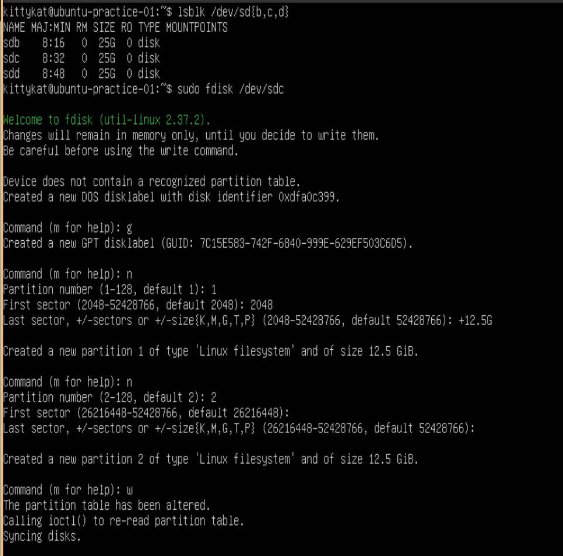
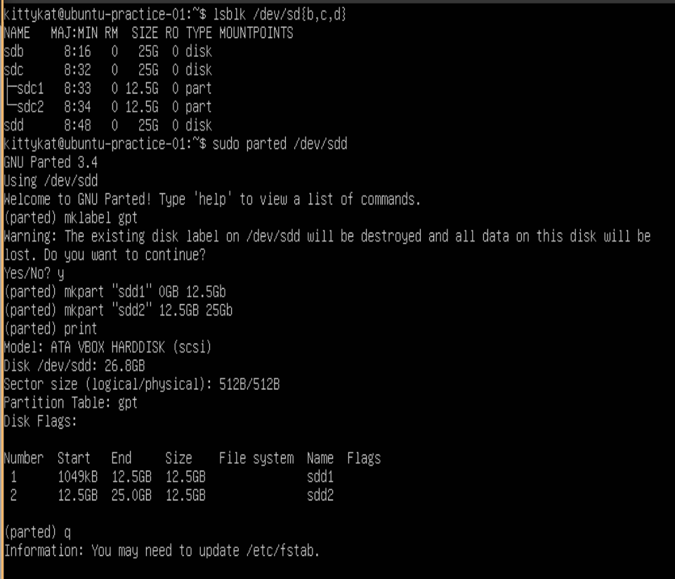
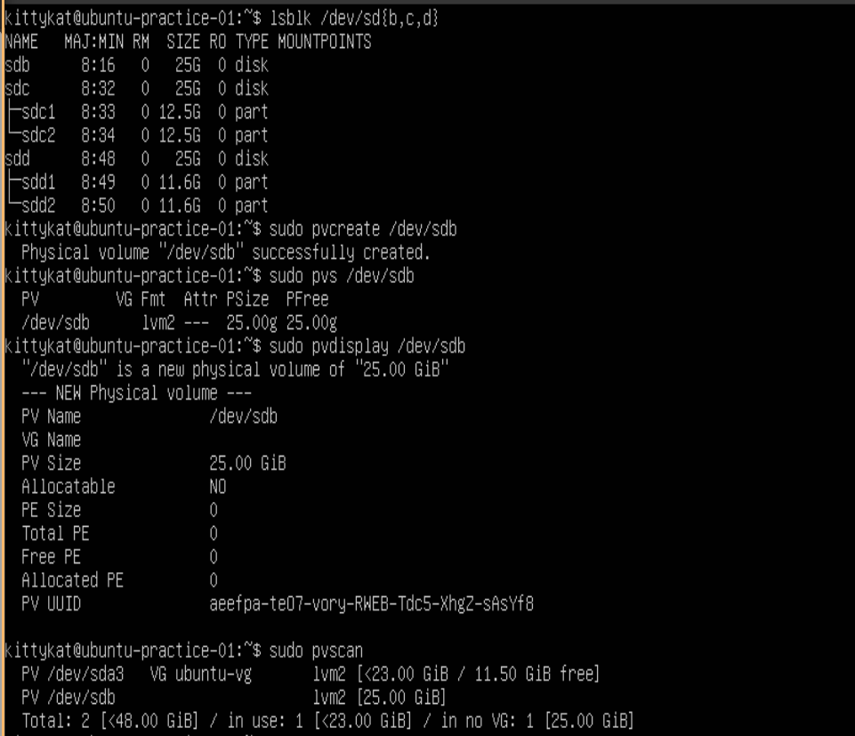
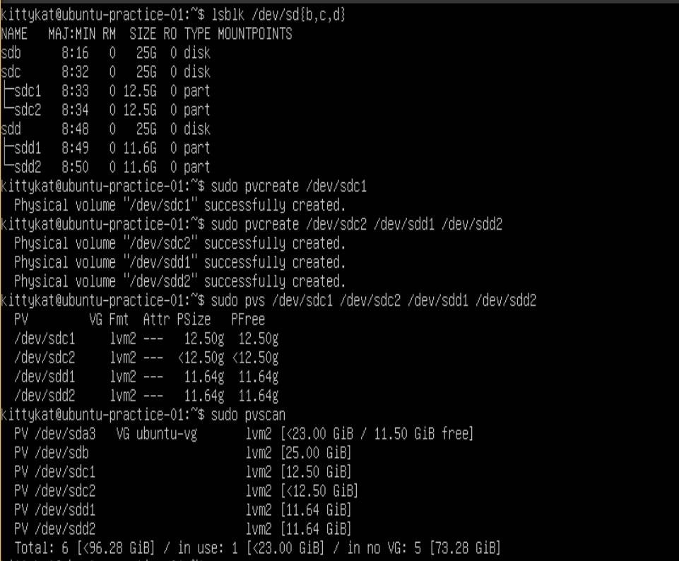
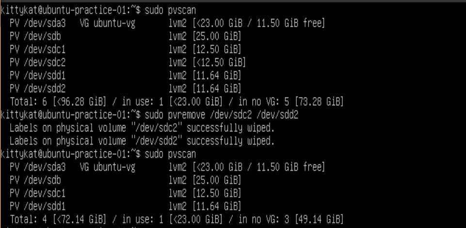
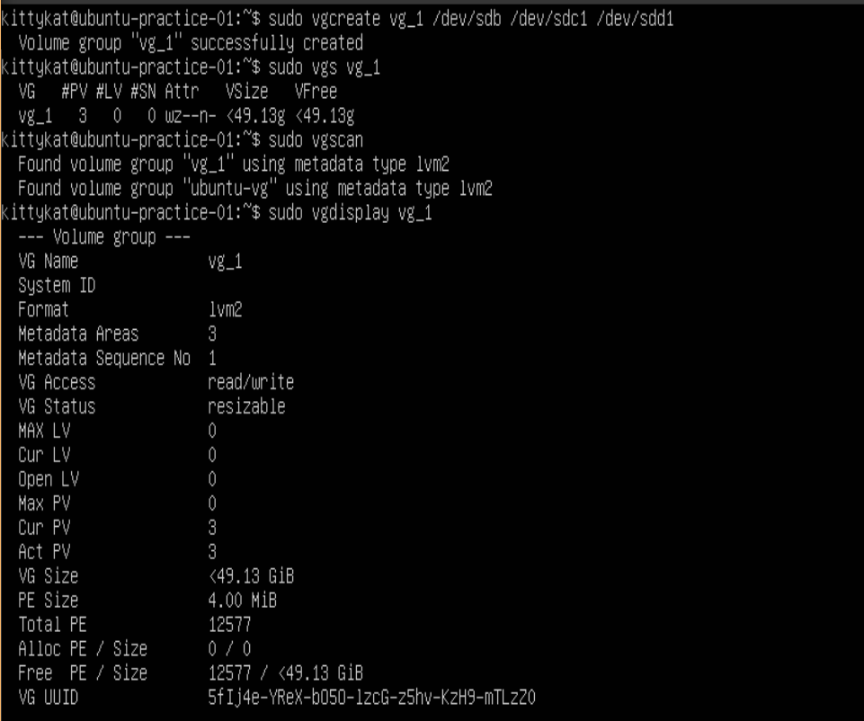
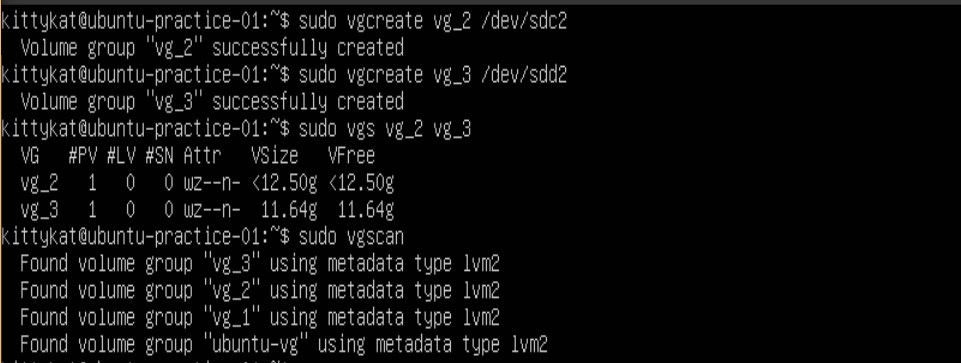
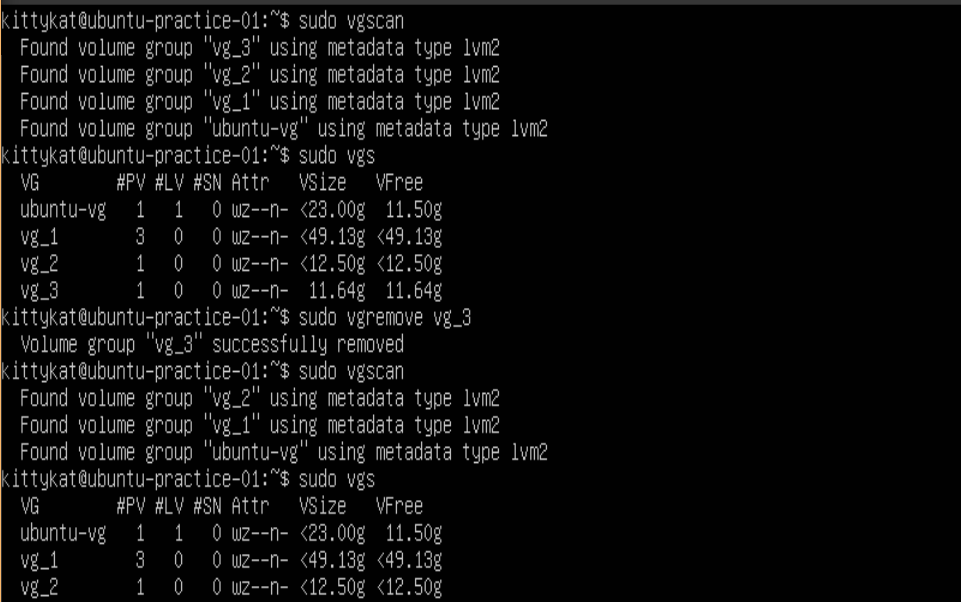
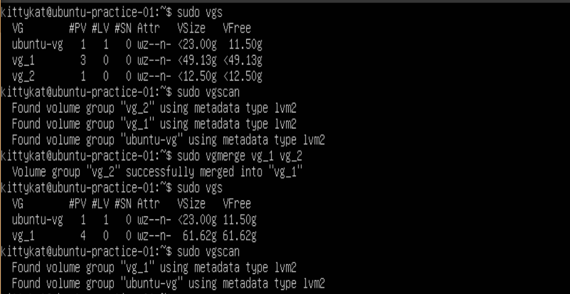
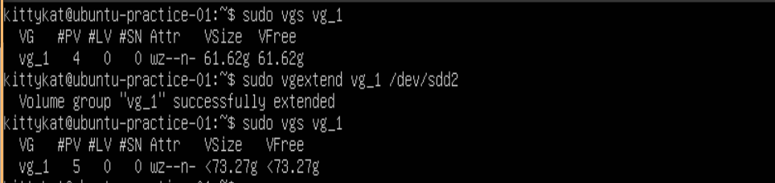

# LVM Storage Management

## Initial Tutorial Setup

```
lsblk /dev/sd{b,c,d}
sudo fdisk /dev/sdc
g
n
1
2048
+12.5G
n
2
26216448
52428766
w
```



```
lsblk /dev/sd{b,c,d}
sudo parted /dev/sdd
mklabel gpt
y
mkpart "sdd1" 0GB 12.5GB
mkpart "sdd2" 12.5GB 25GB
print
q
```



## Physical Volumes

### Create/Initialize Physical Volume(s)

#### Creating and Display Info for a Physical Volume on a unpartitioned disk

```
lsblk /dev/sd{b,c,d}
sudo pvcreate /dev/sdb
sudo pvs /dev/sdb
sudo pvdisplay /dev/sdb
sudo pvscan
```



#### Creating a Physical Volume on a Partition

```
lsblk /dev/sd{b,c,d}
sudo pvcreate /dev/sdc1
sudo pvcreate /dev/sdc2 /dev/sdd1 /dev/sdd2
sudo pvs /dev/sdc1 /dev/sdc2 /dev/sdd1 /dev/sdd2
sudo pvscan
```



### Remove Physical Volume(s)

```
sudo pvscan
sudo pvremove /dev/sdc2 /dev/sdd2
sudo pvscan
```



## Volume Groups

### Create a Volume group from physical volumes

```
sudo vgcreate vg_1 /dev/sdb /dev/sdc1 /dev/sdd1
sudo vgs vg_1
sudo vgscan
sudo vgdisplay vg_1
```



### Create a Volume Group from non-initilized device

```
sudo vgcreate vg_2 /dev/sdc2
sudo vgcreate vg_3 /dev/sdd2
sudo vgs vg_2 vg_3
sudo vgscan
```




### Removing a Volume group

```
sudo vgscan
sudo vgs
sudo vgremove vg_3
sudo vgscan
sudo vgs
```



### Merge two volume groups

```
sudo vgs
sudo vgscan
sudo vgmerge vg_1 vg_2
sudo vgs
sudo vgscan
```



### Extend a Volume Group

```
sudo vgs vg_1
sudo vgextend vg_1 /dev/sdd2
sudo vgs vg_1
```




