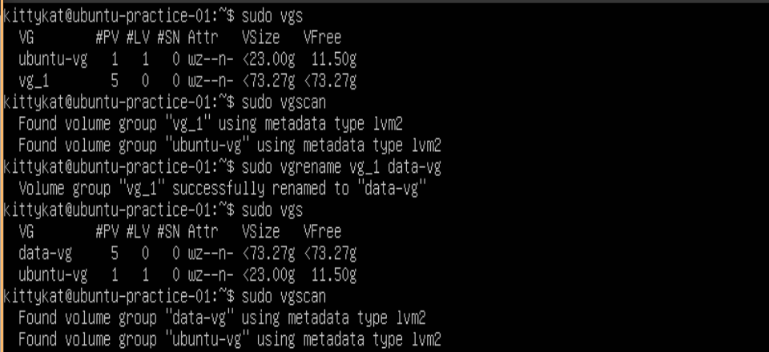
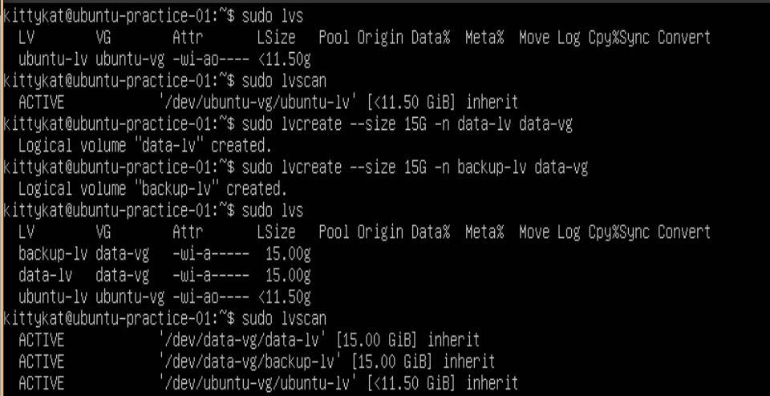
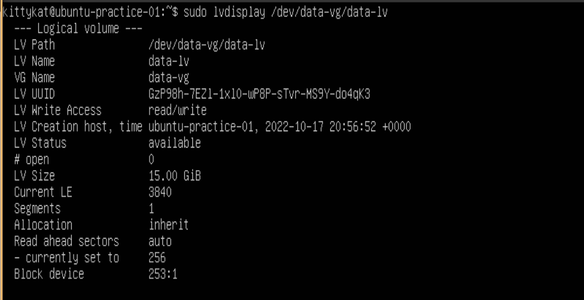
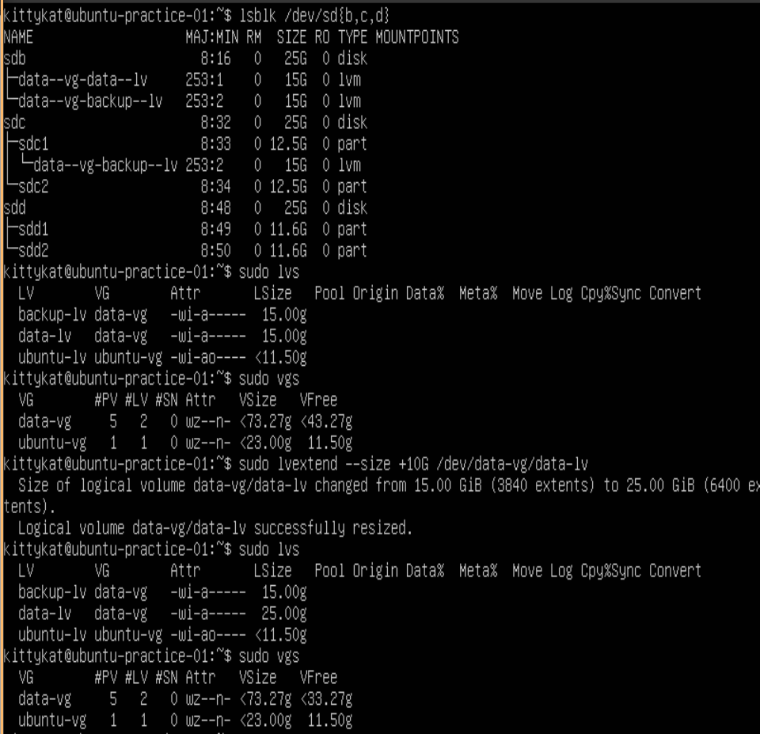
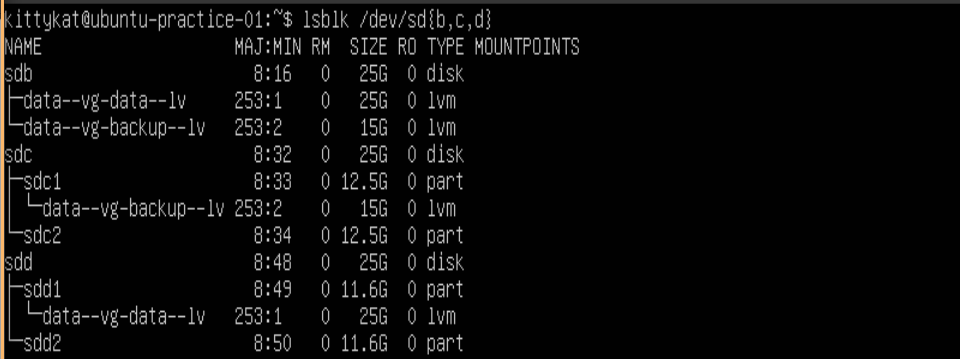
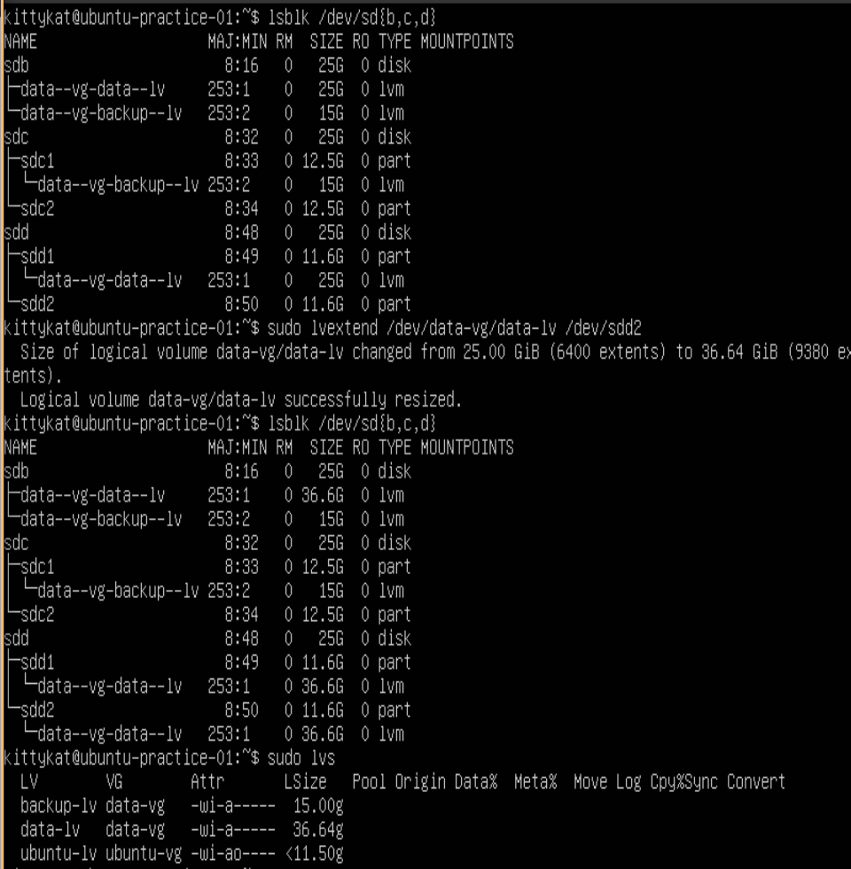
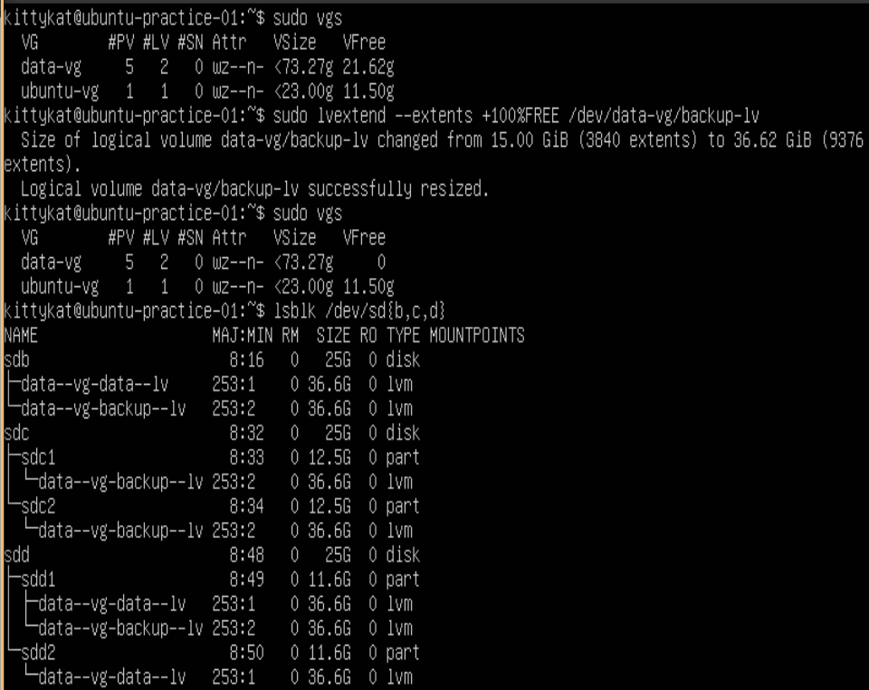
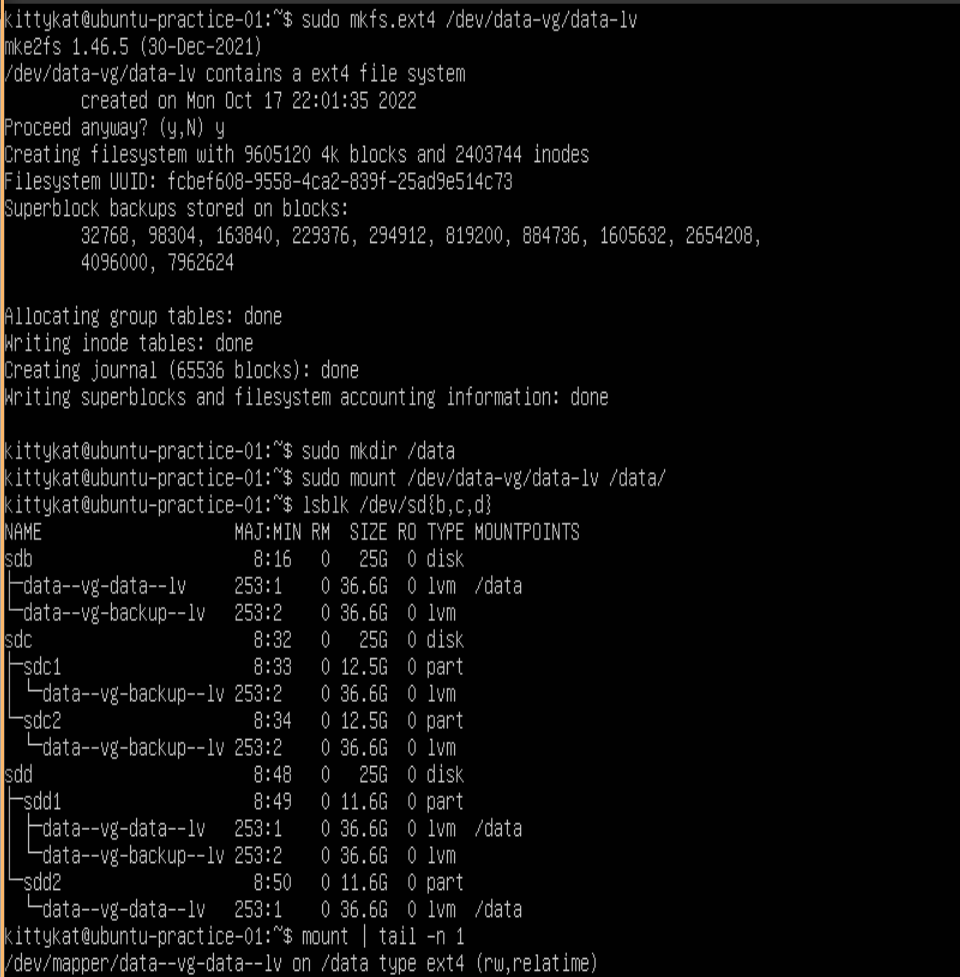

# LVM Storage Management

## Initial Tutorial Setup

```
lsblk /dev/sd{b,c,d}
sudo fdisk /dev/sdc
g
n
1
2048
+12.5G
n
2
26216448
52428766
w
```


```
lsblk /dev/sd{b,c,d}
sudo parted /dev/sdd
mklabel gpt
y
mkpart "sdd1" 0GB 12.5GB
mkpart "sdd2" 12.5GB 25GB
print
q
```


## Physical Volumes

### Create/Initialize Physical Volume(s)

#### Creating and Display Info for a Physical Volume on a unpartitioned disk

```
lsblk /dev/sd{b,c,d}
sudo pvcreate /dev/sdb
sudo pvs /dev/sdb
sudo pvdisplay /dev/sdb
sudo pvscan
```


#### Creating a Physical Volume on a Partition

```
lsblk /dev/sd{b,c,d}
sudo pvcreate /dev/sdc1
sudo pvcreate /dev/sdc2 /dev/sdd1 /dev/sdd2
sudo pvs /dev/sdc1 /dev/sdc2 /dev/sdd1 /dev/sdd2
sudo pvscan
```


### Remove Physical Volume(s)

```
sudo pvscan
sudo pvremove /dev/sdc2 /dev/sdd2
sudo pvscan
```


## Volume Groups

### Create a Volume group from physical volumes

```
sudo vgcreate vg_1 /dev/sdb /dev/sdc1 /dev/sdd1
sudo vgs vg_1
sudo vgscan
sudo vgdisplay vg_1
```


### Create a Volume Group from non-initilized device

```
sudo vgcreate vg_2 /dev/sdc2
sudo vgcreate vg_3 /dev/sdd2
sudo vgs vg_2 vg_3
sudo vgscan
```


### Removing a Volume group

```
sudo vgscan
sudo vgs
sudo vgremove vg_3
sudo vgscan
sudo vgs
```


### Merge two volume groups

```
sudo vgs
sudo vgscan
sudo vgmerge vg_1 vg_2
sudo vgs
sudo vgscan
```


### Extend a Volume Group

```
sudo vgs vg_1
sudo vgextend vg_1 /dev/sdd2
sudo vgs vg_1
```


### Rename a Volume Group

```
sudo vgs
sudo vgscan
sudo vgrename vg_1 data-vg
sudo vgs
sudo vgscan
```



## Logical Volumes

### Create a Logical Volume

```
sudo lvs
sudo lvscan
sudo lvcreate --size 15G -n data-lv data-vg
sudo lvcreate --size 15G -n backup-lv data-vg
sudo lvs
sudo lvscan
```



```
sudo lvdisplay /dev/data-vg/data-lv
```



### Extend a Logical Volume

#### Extend Logical Volume by Size

```
lsblk /dev/sd{b,c,d}
sudo lvs
vgs
sudo lvextend --size +10G /dev/date-vg/data-lv
sudo lvs
sudo vgs
```



```
lsblk /dev/sd{b,c,d}
```



#### Extend Logical Volume by a Physical Volume

```
lsblk /dev/sd{b,c,d}
sudo lvextend /dev/data-vg/data-lv /dev/sdd2
lsblk /dev/sd{b,c,d}
sudo lvs
```



#### Extend Logical Volume by percentage of free left in Volume Group

```
sudo vgs
sudo lvextend --extents +100%FREE /dev/data-vg/backup-lv
sudo vgs
lsblk /dev/sd{b,c,d}
```



## Quick Test of Logical Volume

```
sudo mkfs.ext4 /dev/data-vg/data-lv
sudo mkdir /data
sudo mount /dev/data-vg/data-lv /data
lsblk /dev/sd{b,c,d}
mount | tail -n 1
```



# References

1. man pages


