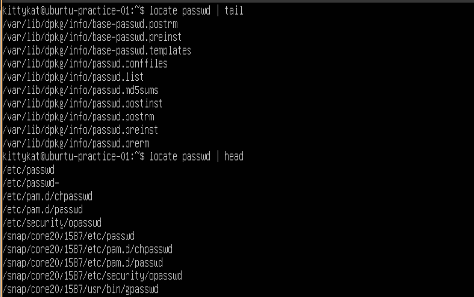
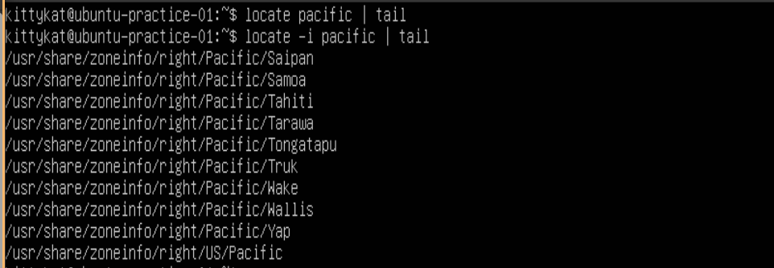
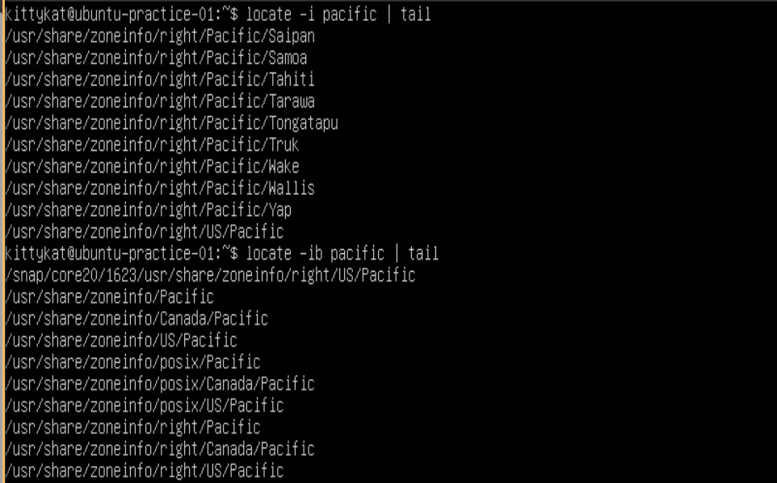
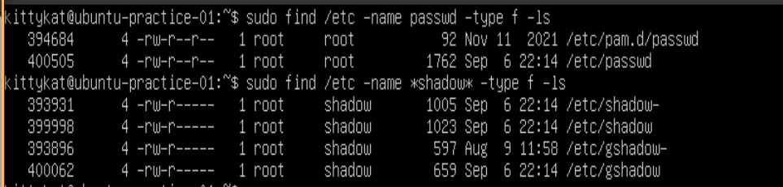
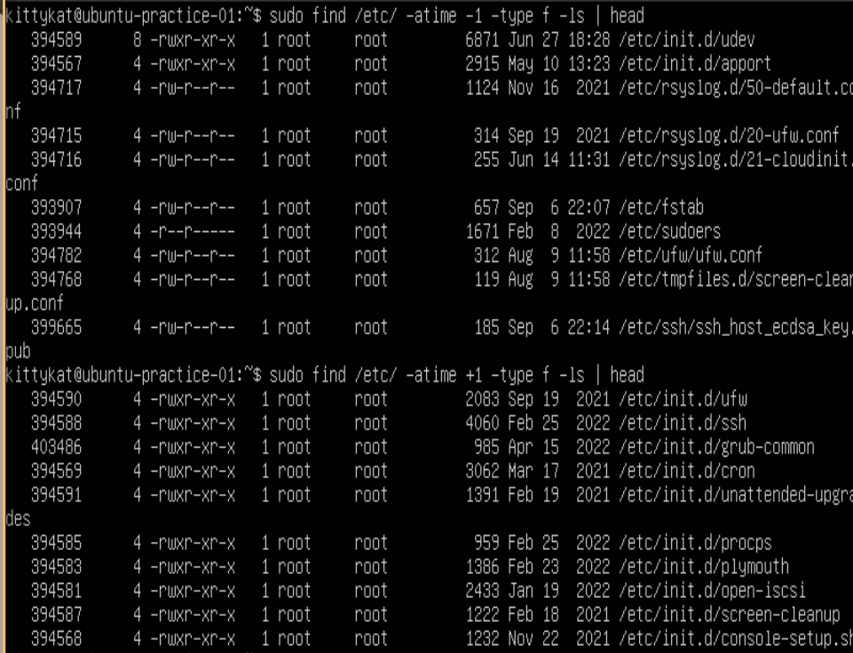
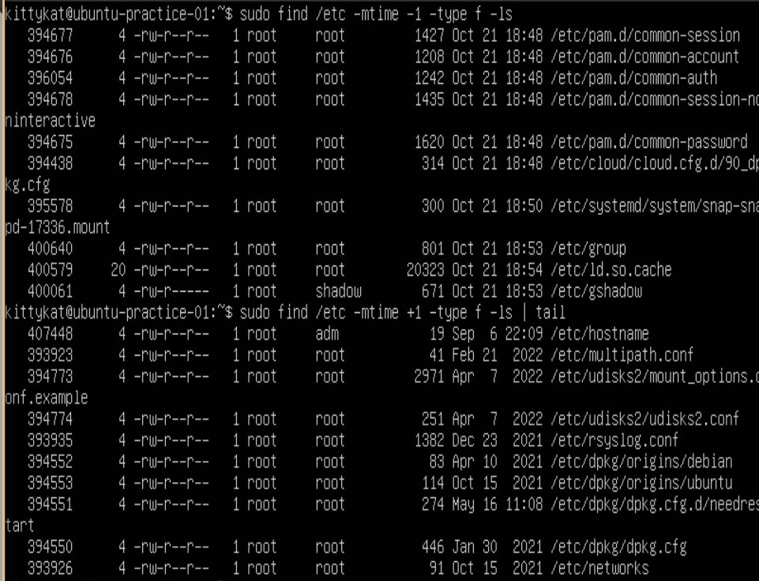
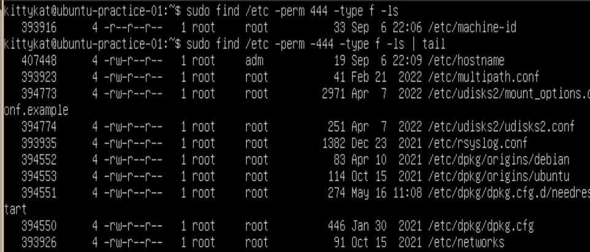
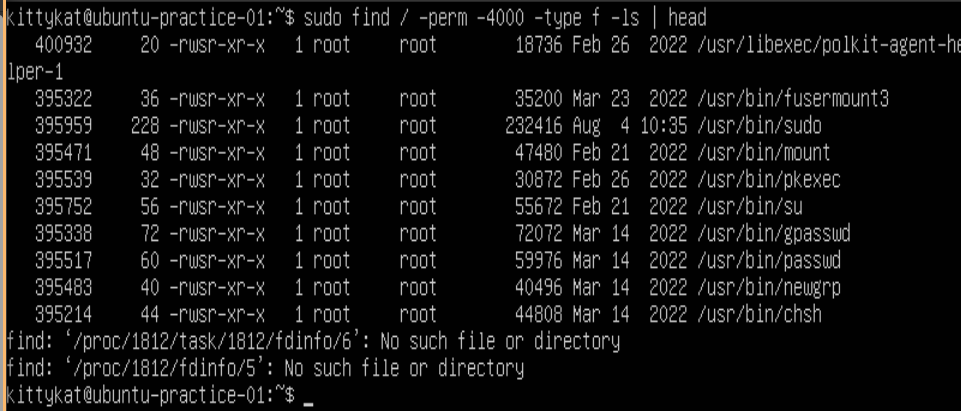
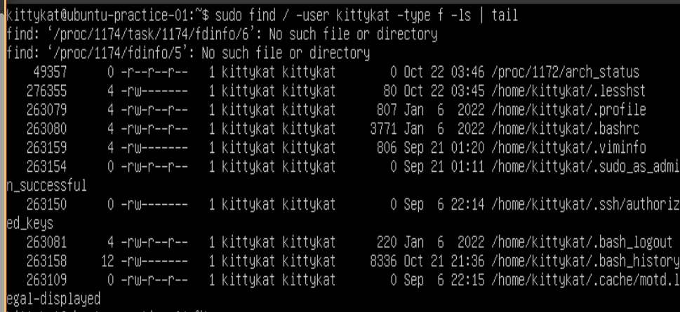
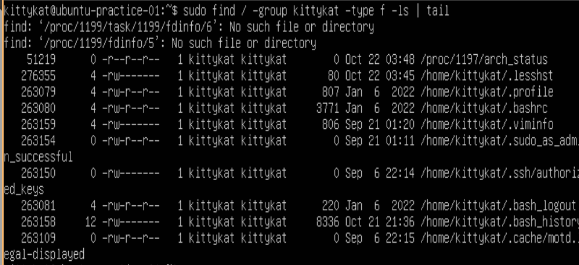

# Searching For Files

## locate

locate requires a database of files and directories to be created and updated regularly to be effective.

### Creating a Database for locate

```
sudo updatedb
```


### Locating Files

```
locate passwd | tail
locate passwd | head
```



### Locating Files with case-insensitive

```
locate pacific | tail
locate -i pacific | tail
```



### Only Locate file and not directories

```
locate -i pacific | tail
locate -ib pacific | tail
```



### Locate, Count Match, but don't display matchs

```
locate -c passwd
```


## find

### Find Files By Name and List Them

```
sudo find /etc -name passwd -type f -ls
sudo find /etc -name *shadow* -type f -ls
```



### Find Files by Access time in days

```
sudo find /etc -atime -1 -type f -ls | head
sudo find /etc -atime +1 -type f -ls | head
```



### Find Files by Modify time in days

```
sudo find /etc -mtime -1 -type f -ls
sudo find /etc -mtime +1 -type f -ls | tail
```




### File File By Permissions

```
sudo find /etc -perm 444 -type f -ls
sudo find /etc -perm -444 -type f -ls | tail
```



```
sudo find / -perm -4000 -type f -ls | head
```



### Find Files by User Owner

```
sudo find / -user kittykat -type f -ls | tail
```



### Find Files by Group Owner

```
sudo find / -group kittykat -type f -ls | tail
```




