# Tar and Compression

## Setup

### Create Files

```
touch testfile{1..9}.txt
mkdir testdir{1..3}
for i in {1..3}; do touch testdir$i/example"$i"file{1..9}.txt; done
ls -R
```

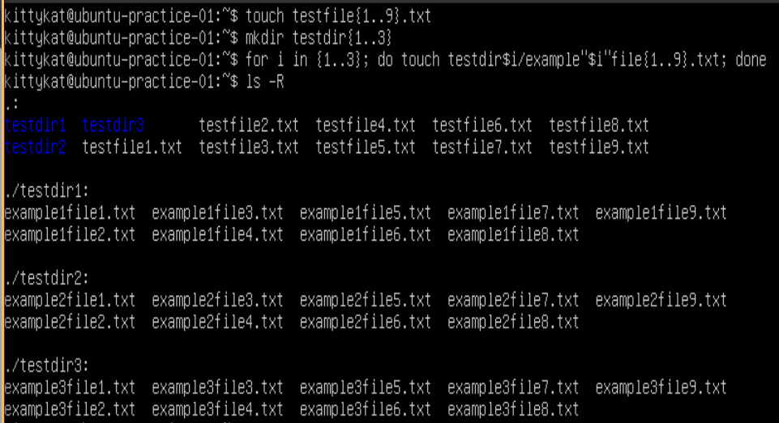

### Fill Some Files With Data

```
ls
for i in {1..10000}; do echo "repetitive data: blah blah blah" >> testfile1.txt; done
head -n 5 testfile1.txt
du -h testfile1.txt
dd if=/dev/urandom of=testfile2.txt bs=1M count=1024 status=progress
du -h testfile2.txt
dd if=/dev/zero of=testfile3.txt bs=1M count=1024 status=progress
du -h testfile2.txt
```

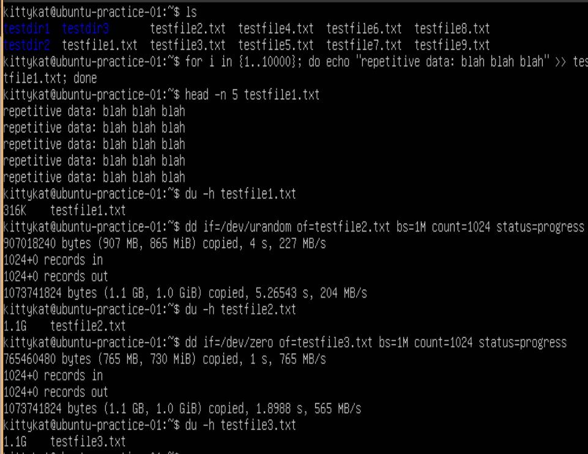

## gzip

### Basic Usage Of gzip

#### Compression

```
ls -l testfile1.txt*
du -h testfile1.txt*
gzip testfile1.txt
ls -l testfile1.txt*
du -h testfile1.txt*
```


#### Decompress

```
ls
gzip -d testfile1.txt.gz
ls
gzip testfile1.txt
ls -l testfile1.txt*
gunzip testfile1.txt.gz
ls -l testfile1.txt*
ls
```

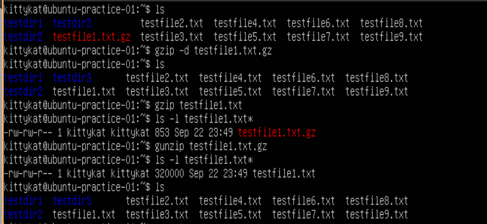

### Keeping original file with gzip

```
ls
gzip -k testfile1.txt
ls
gzip -d testfile.txt.gz
n
ls
gzip -d testfile.txt.gz
y
ls
```

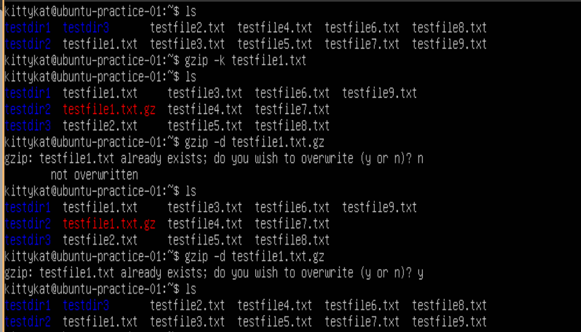

### Verbose and more info on compression gzip

```
ls
du -h testfile{1,2,3}.txt
gzip -v testfile1.txt
gzip -v testfile2.txt testfile3.txt
gzip -l testfile{1,2,3}.txt.gz
du -h testfile{1,2,3}.txt.gz
ls
gunzip -v testfile{1,2,3}.txt.gz
ls
```

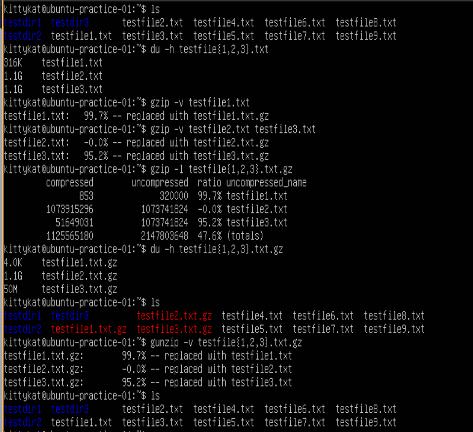

### Recursively compress files

```
ls testdir1
gzip -rv testdir
ls testdir1
gzip -drv testdir1
ls testdir1
```

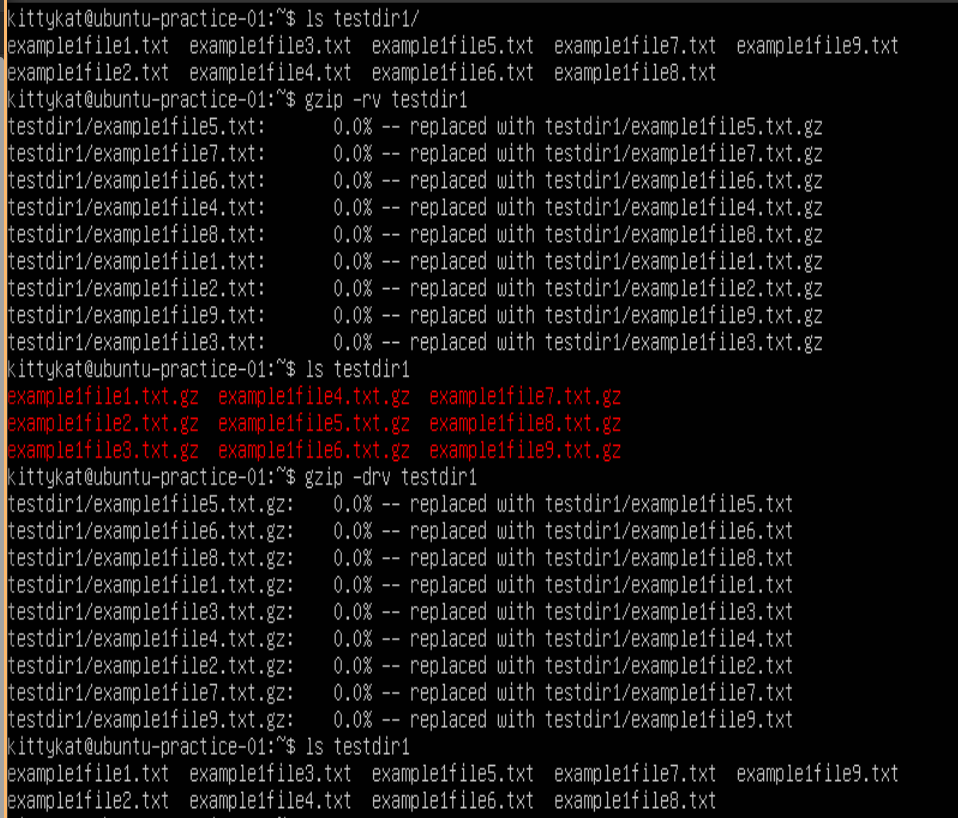

### Fast vs Best Compression

```
ls
du -h testfile{1,2,3}.txt
gzip -v --best test{1,2,3}.txt
du -h testfile{1,2,3}.txt.gz
gunzip testfile{1,2,3}.txt.gz
gzip -v --fast testfile{1,2,3}.txt
du -h testfile{1,2,3}.txt.gz
gunzip testfile{1,2,3}.txt.gz
ls
```

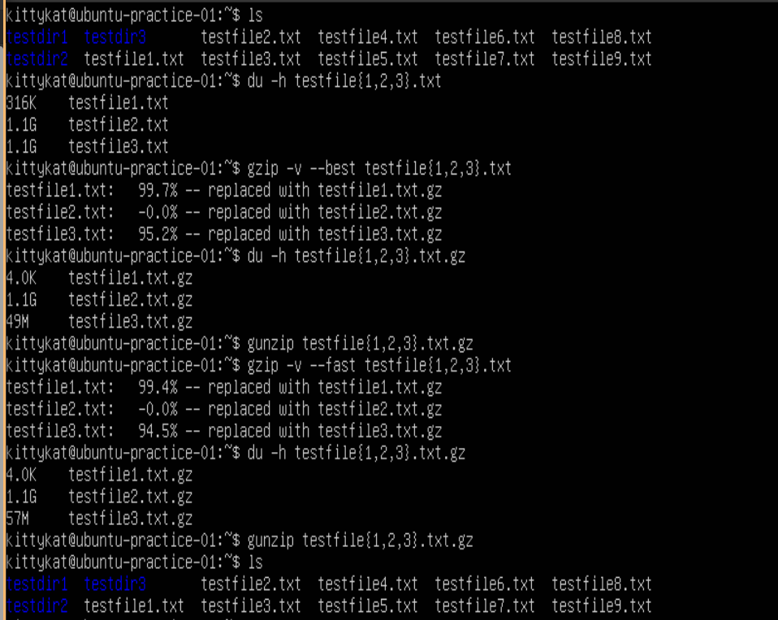

## xz

xz is quite powerful with lots of nuanced options, we will just cover the basics

### No option xz compressions and decompression

```
ls
du -h testfile{1,3}.txt
xz testfile1.txt
xz -z testfile3.txt
du -h testfile{1,3}.txt.xz
ls
unxz testfile1.txt.xz
xz -d testfile3.txt.xz
ls
```


### xz with basic options

```
ls
xz -kv testfile{1..3}.txt
du -h testfile{1..3}.txt.xz
ls
rm testfile{1..3}.txt
ls
unxz -k testfile{1..3}.txt.xz
ls
rm testfile{1..3}.txt.xz
``` 

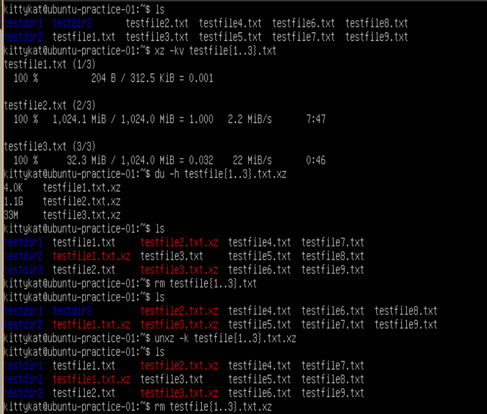

## bzip2

### No options bzip2 compression and decompression

```
ls
du -h testfile{1,3}.txt
bzip2 testfile1.txt
bzip2 -z testfile3.txt
ls
du -h testfile{1,3}.txt.bz2
bunzip2 testfile1.txt.bz2
bzip2 -d testfile3.txt.bz2
ls
```


### bzip2 with basic options

```
ls
bzip2 -kv testfile{1..3}.txt
du -h testfile{1..3}.txt.bz2
ls
rm testfile{1..3}.txt
ls
bunzip2 -k testfile{1..3}.txt.bz2
ls
rm testfile{1..3}.txt.bz2
``` 


## tar

Note: tar is a large program with lots of options and considerations. We are only going to cover the basics here.

### Create a basic tar archive

```
ls
ls testdir1
tar -cvf testdir1.tar testdir1
ls
```


### Compare a archive with changes to the original files

```
ls
tar -d -f testdir1.tar testdir1/
echo "test test" >> testdir1/example1file1.txt
tar -d -f testdir1.tar testdir1/
touch testdir1/newfile
tar -d -f testdir1.tar testdir1/
ls testdir1/
tar -d -f testdir1.tar testdir1/
rm testdir1/example1file2.txt
tar -d -f testdir1.tar testdir1/
```

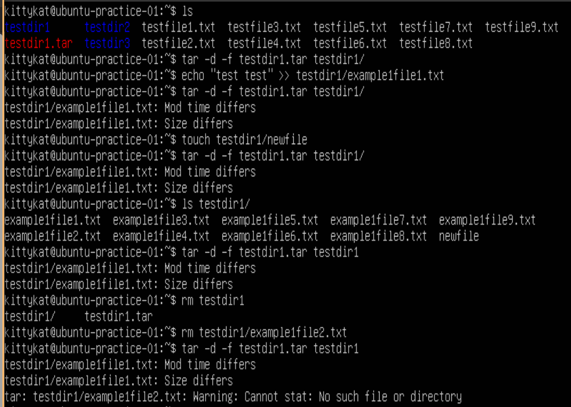


### Extract archive 

```
ls 
rm -r testdir1
ls
tar -xvf testdir1.tar
ls
``` 

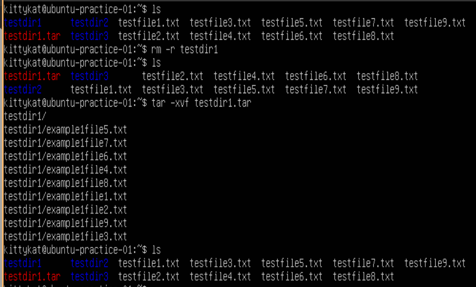

### List the contents of an archive

```
ls
tar -tf testdir1.tar
```


### Append files to an archive

```
ls
mv testdir1.tar testarchive.tar
ls
tar -r -f testarchive.tar testdir2/ testfile1.txt
tar -tf testarchive.tar
```

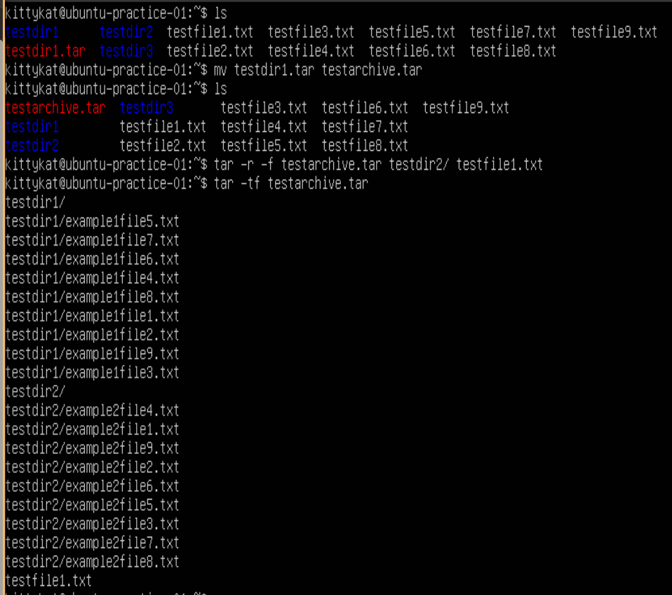

### Concatenate archives

```
ls
tar -cf testdir3.tar testdir3/
ls
tar -Af testarchive.tar testdir3.tar
ls
tar -tf testarchive.tar | tail
tar -tf testarchive.tar | head -n 5
```

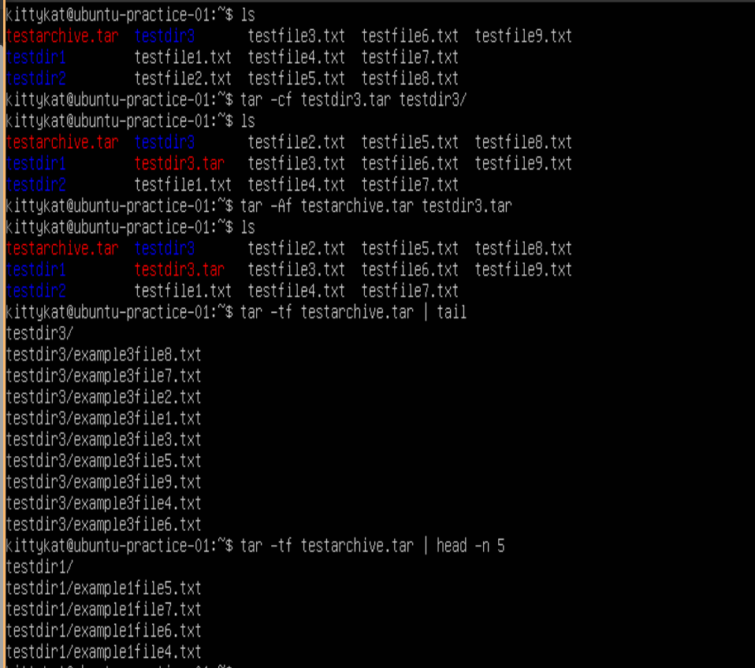

### Decompression chamber

When opening a tar archive it is best practice to open it in a new directory just in case the archive happens to be a tar bomb (.i.e. what we just made, kinda).

```
ls
mkdir decompression_chamber
mv testarchive.tar decompression_chamber/
cd decompression_chamber
tar -xf testarchive.tar
ls
``` 

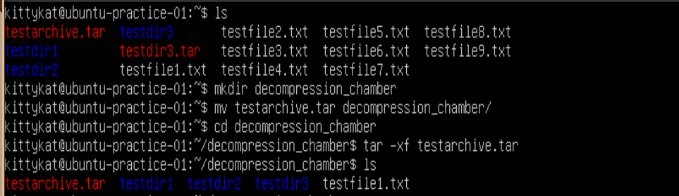

### tar with compression

```
ls
tar -czf testdir1.tar.gz testdir1
tar -cjf testdir2.tar.bz2 testdir2
tar -cJf testdir3.tar.xz testdir3
ls
tar -tf testdir1.tar.gz
```

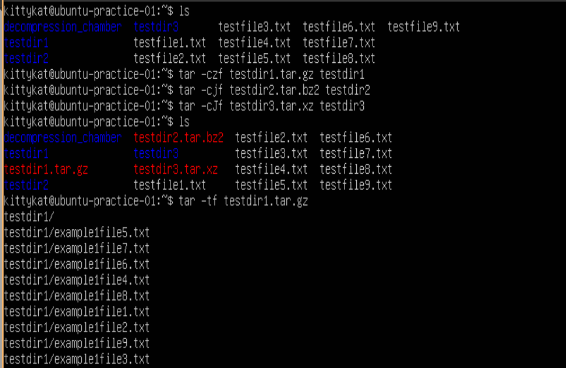

### tar and decompression

```
ls
rm -r testdir?
ls
tar -xzf testdir1.tar.gz
tar -xjf testdir2.tar.bz2
tar -xJf testdir3.tar.xz
ls
rm -r testdir1
ls
gunzip testdir1.tar.gz
tar -xf testdir1.tar
ls
```


## zip command

```
ls
zip archive.zip testdir* testfile*
rm -r test*
unzip archive.zip
ls
```

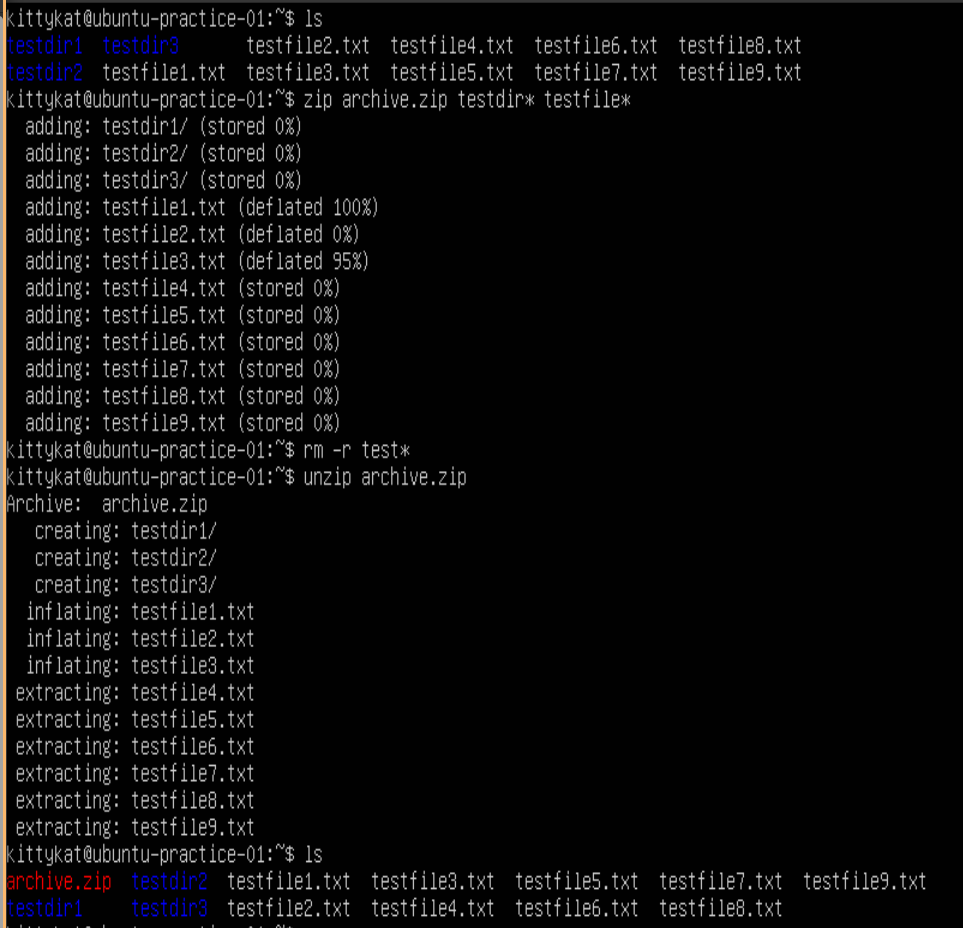


