# User And Group Management Commands

## adduser command

### Adding a normal user with just the defaults 

```
sudo adduser user01
*Enter password for sudo priviledges*
*Enter a password for user01*
*Re-type the password for user01*
ENTER
ENTER
ENTER
ENTER
ENTER
Y
```

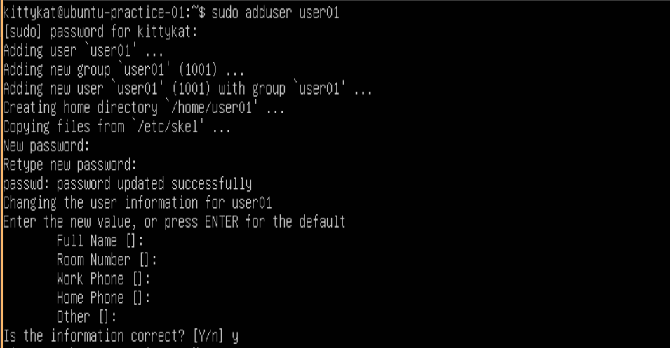

Verify the results of `sudo adduser user01`

```
ls /home
grep user01 /etc/passwd
id user01
```

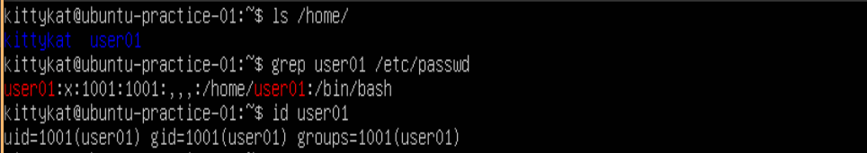

Verify that user01 doesn't have sudo priviledges

```
su - user01
*Enter user01's password*
sudo vim /etc/shadow
*Enter user01's password*
```

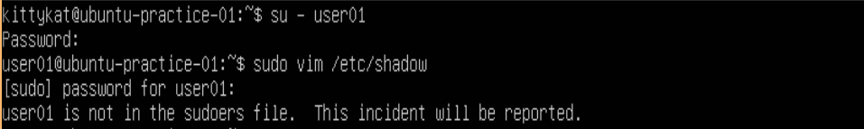

Logout or exit from user01

```
exit
```

### Adding a normal user with comments

```
sudo adduser user02
*Enter password for sudo priviledges*
*Enter a password for user02*
*Re-enter the password for user02*
user02
101
1-234-567-8910
1-234-567-8910
Comments
y
```

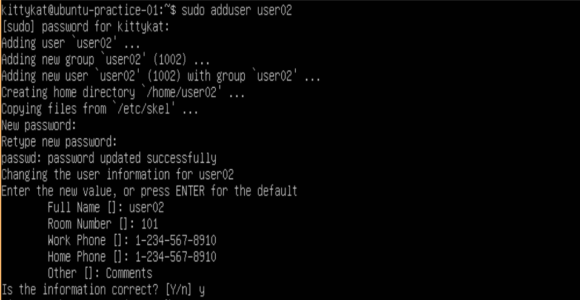

Verify the results of `sudo adduser user02`

```
ls /home
grep user01 /etc/passwd
id user01
```

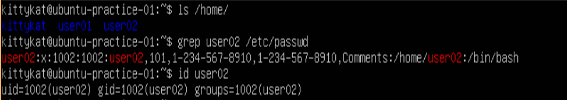


### Adding a normal user with a non-default shell and home directory

```
sudo adduser --shell /bin/sh --home /home/user03_home user03
```


Verify the results of adding user03

```
ls /home
grep user03 /etc/passwd
id user03
su - user03
*Enter user03 password*
echo $SHELL
exit
```

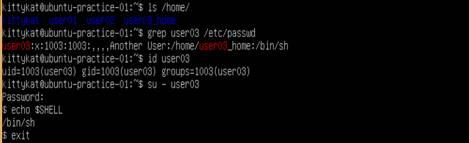

### Adding a system user

System users or service accounts are typically created when a new service is install to provide the necessary security context for the service. We can create a system user/account with

```
sudo adduser --system system_user01
```

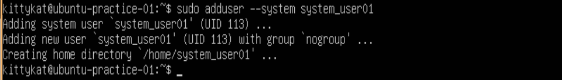

Inspect system\_user01 properties

```
ls /home
grep system_user01 /etc/passwd
id system_user01
sudo grep system_user01 /etc/shadow
```

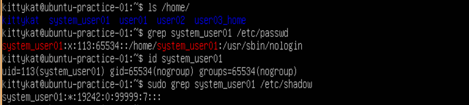

Notice the second field is a * . This is not a valid output of crypt(3) thus the system\_user01 will not be able to use a unix style password to log in, but may be able to login via another method. 

## addgroup command

### Adding A Group With No Options

add a normal group with the following

```
addgroup group01
```

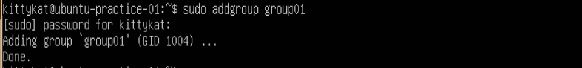

Verify group01 was created

```
grep group01 /etc/group
```
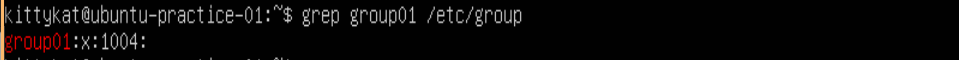

### Adding a Group With A Specific GID

```
addgroup --gid 2222 group02
```

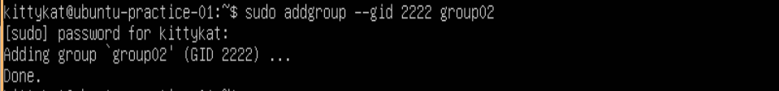

Verify group02 was created

```
grep group02 /etc/group
```

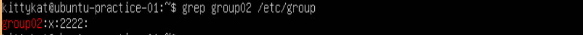


### Adding an existing user to a group

```
adduser user01 group01
grep group01 /etc/group
id user01
```

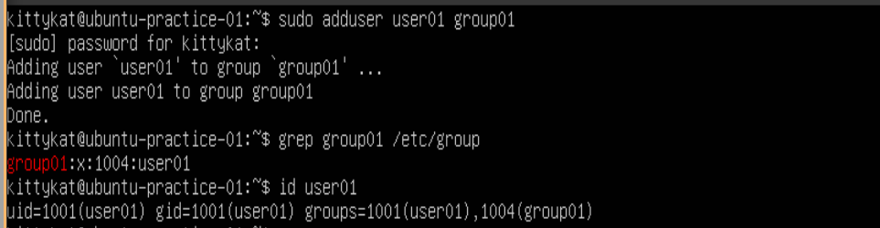

## deluser command

### Delete A User

```
ls /home
grep user02 /etc/passwd
id user02
deluser user02
ls /home
grep user02 /etc/passwd
grep user02 /etc/group
```

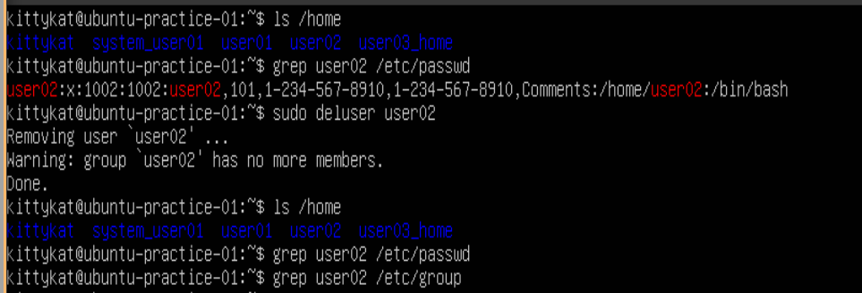

Note: the users home directory and mail spool (if created) did not get deleted.
Let's remove user02's home directory manually

```
rm -r /home/user02
```

### Delete A User and Their Home Directory

```
ls /home
grep system_user01
id system_user01
deluser --remove-home system_user01
ls /home
grep system_user01 /etc/passwd
```

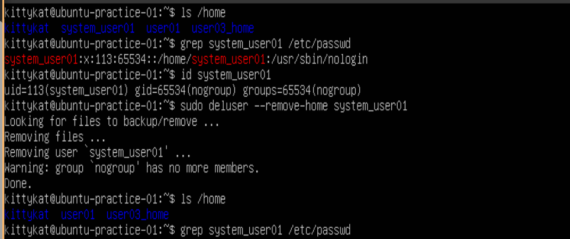

### Delete a User and All Their Files

What if the user has a file not in their home directory that we also want to remove.
We can remove all the files own by the user as follows. First we'll create some file for demo purposes.

```
cd ..
ls
sudo mkdir user03_files
sudo chown user03:user03 user03_files/
ls -l
```

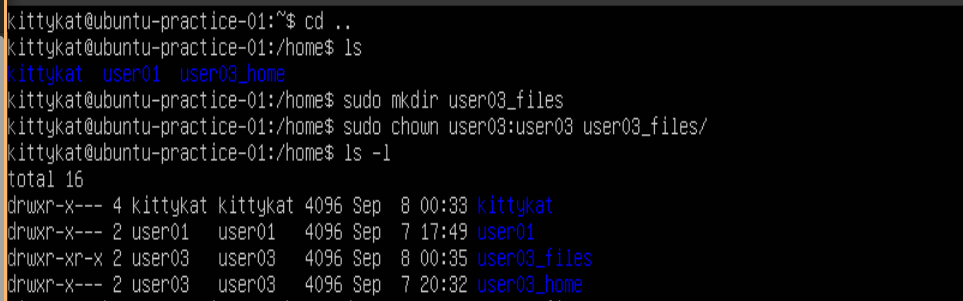

Lets create some more user03 files

```
su - user03
whoami
cd ../user03_files
touch file1.txt
touch file2.txt
ls -l
touch /tmp/another_file.txt
ls -l /tmp/another_file.txt
exit
```


Let's finally delete user03

```
sudo deluser --remove-all-files user03
ls /home
ls /tmp
```

## delgroup command

### Delete An empty Group

```
tail -n 2 /etc/group
sudo delgroup group02
tail -n 2 /etc/group
```

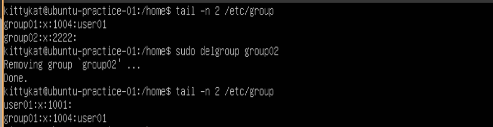


### Delete a non-empty Group

```
tail -n 2 /etc/group
sudo delgroup group01
tail -n 2 /etc/group
```

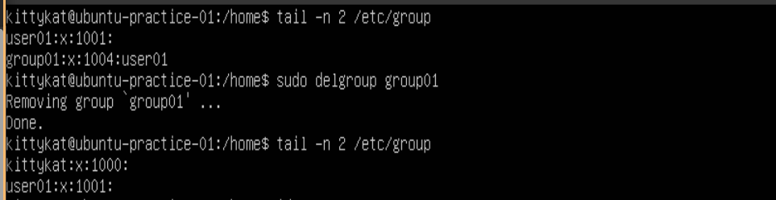


## useradd command

### useradd with no options

```
sudo useradd user02
ls /home
grep user02 /etc/passwd
sudo grep user02 /etc/shadow
```

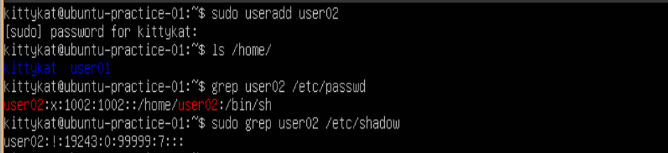

Notice the ! mark for user02's password and that the home directory for user02 is /home/user02but the directory was not actually created.

### useradd create home dir

```
sudo useradd -m user03
ls /home
grep user03 /etc/passwd
sudo grep user03 /etc/shadow
```

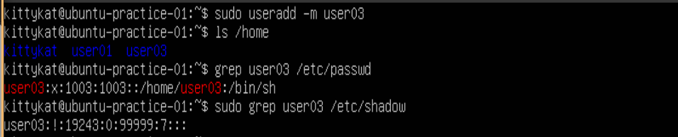

The home directory was created but no password.

### Useradd with a bunch of options

Create user04, their home directory, assign them bash as their shell, give them uid 1111, and add a comment in the /etc/passwd file.

```
useradd -m -s /bin/bash -u 1111 -c "koi pond" user04
ls /home
grep user04 /etc/passwd
sudo grep user04 /etc/shadow
id user04
```

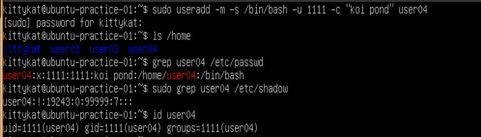

## groupadd command

### groupadd with no comments

```
groupadd group01
tail -n 5 /etc/group
```

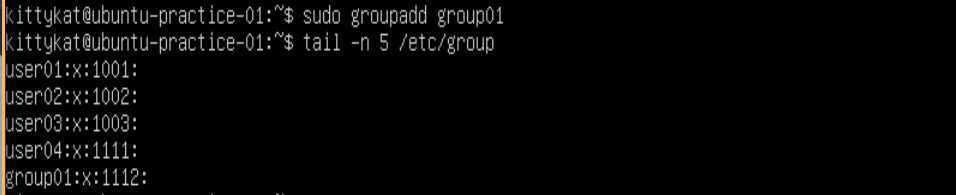

### groupadd with custume GID

```
groupadd -g 2022 group02
tail -n 5 /etc/group
```

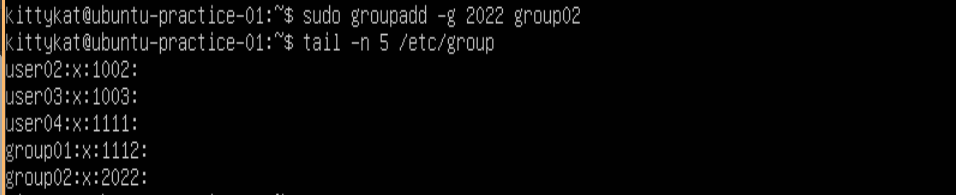


## usermod command

### Change a user's name

```
tail -n 5 /etc/passwd
ls /home
sudo usermod -l new_user01 user01
ls /home
tail -n 5 /etc/passwd
```


### Change a user's home directory

Note: Just renaming the user's home directory is not sufficient since their default environment variables will also need to be changed.

```
grep new_user01 /etc/passwd
ls /home
usermod -m -d new_user01 new_user01
grep new_user01 /etc/passwd
ls /home
```

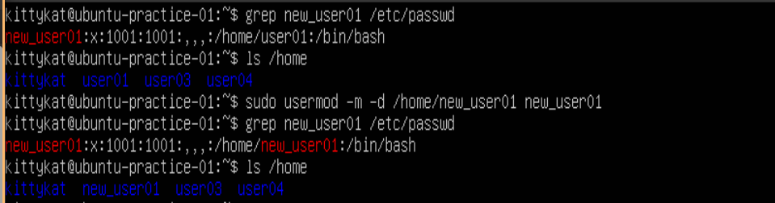


### Change a user's shell

```
grep user02 /etc/passwd
sudo usermod -s /bin/bash user02
grep user02 /etc/passwd
sudo su - user02
echo $SHELL
exit
```

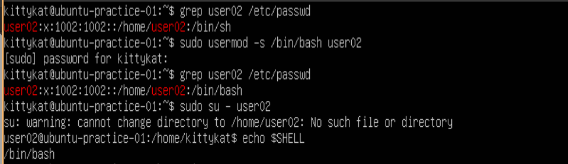

### Add or change a user comment

```
grep user02 /etc/passwd
sudo usermod -c "new comment" user02
grep user02 /etc/passwd
```

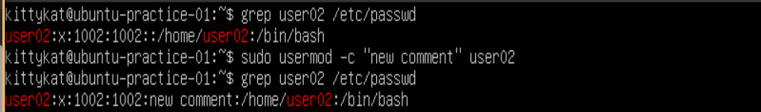

### Add a user to a group

First we are not going to use the -a option to demo an issue that can arise, then use -a option.

```
tail -n 2 /etc/group
id user02
sudo usermod -G group02 user02
tail -n 2 /etc/group
id user02
sudo usermod -G group01 user02
tail -n 2 /etc/group
id user02
sudo usermod -aG group02 user02
tail -n 2 /etc/group
id user02
```


Note: we can use -G without the -a option in a creative way to remove a user from a group. You can also do the following.

```
tail -n 2 /etc/group
id user02
sudo deluser user02 group01
tail -n 2 /etc/group
id user02
```

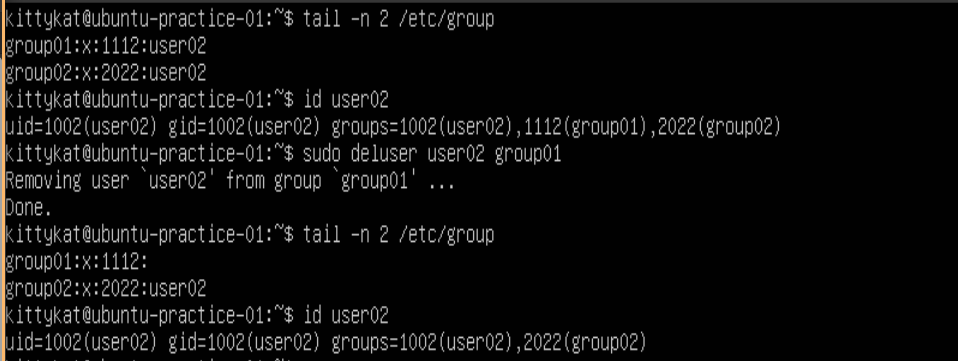

## groupmod command

### Change a group name

```
tail -n 2 /etc/group
id user02
sudo groupmod -n new_group02 group02
tail -n 2 /etc/group
id user02
```

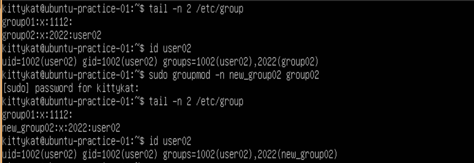

### Change GID of user primary group

```
grep "user02" /etc/passwd
grep "user02" /etc/group
sudo groupmod -g 1222 user02
grep "user02" /etc/passwd
grep user02" /etc/group
```

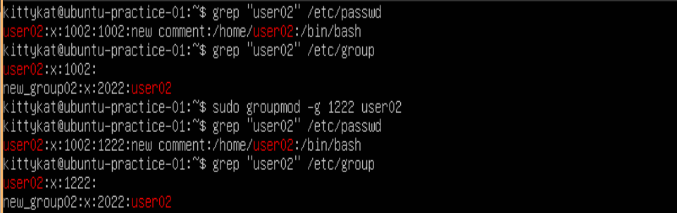

### Change GID of standard group

```
tail -n 2 /etc/group
touch testfile.txt
sudo chown :group01 testfile.txt
ls -l testfile.txt
sudo groupmod -g 1010 group01
tail -n 2 /etc/group
ls -l testfile.txt
```

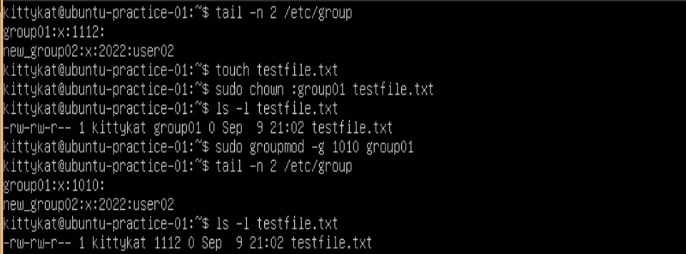

Notice the testfile group ownership did not get changed.

## userdel command

### Delete a user without removing home folder

```
ls /home
grep "new_user01" /etc/passwd
sudo userdel new_user01
ls /home
grep "new_user01" /etc/passwd
sudo rm -r /home/new_user01
```

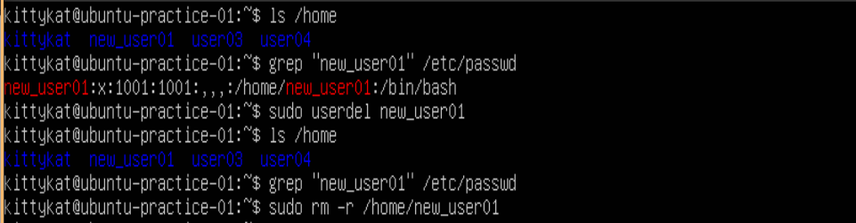

### Delete a user and their home directory

```
ls /home
grep "user04" /etc/passwd
sudo userdel -r user04
ls /home
grep "user04" /etc/passwd
```

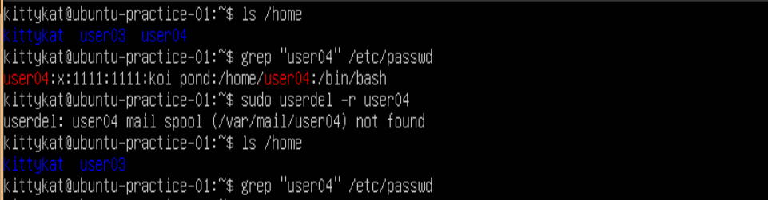

## groupdel command

### Delete a empty group

```
tail -n 2 /etc/group
sudo groupdel group01
tail -n 2 /etc/group
```


### Delete a non-empty group

```
tail -n 2 /etc/group
id user02
sudo groupdel new_group02
tail -n 2 /etc/group
id user02
```

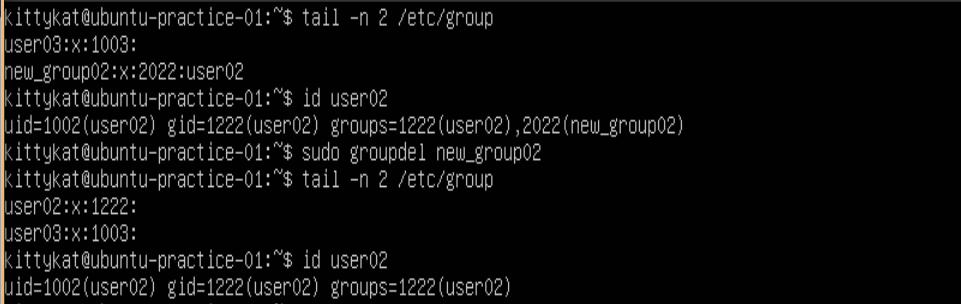


# References

1. man pages
