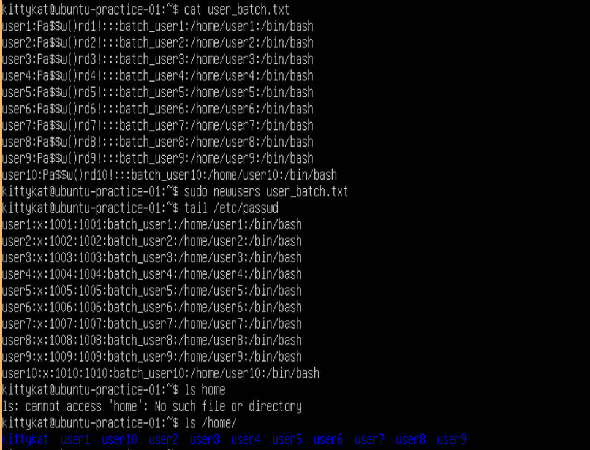
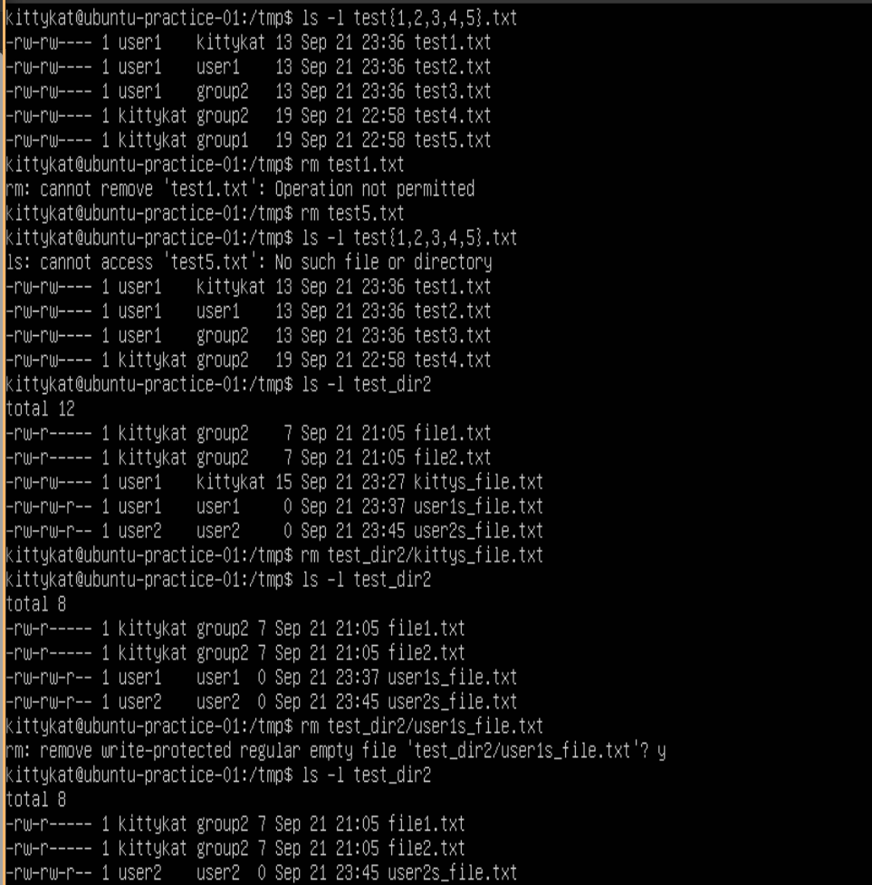

# User And Group Permissions

## Setup

Let first create some users and groups.

Create a file with the following info:

### Create 10 users

```
vim user_batch.txt
```

You can copy paste the text below or in vim type the first line, yank the line `yy`, paste it 9 more time `9p` then use `:s/1/x/g` replacing x with the correct numbers to quickly create the file.

```
user1:Pa$$w()rd1!:::batch_user1:/home/user1:/bin/bash
user2:Pa$$w()rd2!:::batch_user2:/home/user2:/bin/bash
user3:Pa$$w()rd3!:::batch_user3:/home/user3:/bin/bash
user4:Pa$$w()rd4!:::batch_user4:/home/user4:/bin/bash
user5:Pa$$w()rd5!:::batch_user5:/home/user5:/bin/bash
user6:Pa$$w()rd6!:::batch_user6:/home/user6:/bin/bash
user7:Pa$$w()rd7!:::batch_user7:/home/user7:/bin/bash
user8:Pa$$w()rd8!:::batch_user8:/home/user8:/bin/bash
user9:Pa$$()wrd9!:::batch_user9:/home/user9:/bin/bash
user10:Pa$$w()rd10!:::batch_user10:/home/user10:/bin/bash
```

After creating the batch file, run the following command to quickly create the ten users.

```
cat user_batch.txt
sudo newusers user_batch.txt
tail /etc/passwd
ls /home
```



### Create 10 groups

```
tail /etc/group
for i in {1..10}; do sudo groupadd group$i; done
tail /etc/group
```


### Add users to groups

```
tail /etc/group
for i in {1..10}; do for j in $(seq 1 $i); do sudo usermod -aG group$i user$j; done; done
tail /etc/group
```


## Overview of standard permisions

### Displaying Permissions

```
ls -l ~
ls -ld /home
ls -ld /tmp
```


Notice: the entry for the file user_batch.txt starts with a -, this indicates a regular file, whereas /home starts with a d, indicating a directory. There are a few other types which we won't go into now.

The rest of a entry discribes the permisions string, the owner, the group, size, modify time, and name.

For example using the touch command we can "modify" and update the time stamp on user_batch.txt.

```
touch user_batch.txt
ls -l ~
```


The permission string is broken down into owner permissions, group permissions, and other (everyone else) permissions.

For user_batch.txt the owner permissions are rw-, the group permissions are rw-, and others is r--. These are set when the file is created and are determined by umask.


r = 4
w = 2
x = 1

suid = 4
guid = 2
stricky =1


### Changing the Umask

```
umask
touch test_file.txt
ls -l test_file.txt
umask 0022
touch test_file2.txt
ls -l test_file*
```


Note: this umask change is not persitent. To make it persistent it needs to be specified in the system or user bashrc files.

### Changing permissions

```
ls -l test_file.txt
chmod u+x,g=rx,o-r test_file.txt
ls -l test_file.txt
ll test_file2.txt
chmod 750 test_file2.txt
ll test_file2.txt
```


### Changing suid, guid, and sticky bit

Note: modern linux ignores the sticky bit on file but not on directories

```
ls -l test_file.txt
chmod u+s test_file.txt
ls -l test_file.txt
ls -l test_file2.txt
chmod 2750 test_file2.txt
ls -l test_file2.txt
mkdir test_dir
ls -ld test_dir
chmod 1777 test_dir
ls -ld test_dir
```


Note: is the underlying permission in not set, the special permission will be displayed as a capital letter.

## Changing User and Group Ownership

### Create test files

Note: only root (or sudo) can change file ownership

```
umask 0026
cd /tmp
touch test{1..10}.txt
for i in {1..10}; do echo "secret" >> test$i.txt; done
mkdir test_dir{1..10}
for i in {1..10}; do for j in $(seq 1 $i); do echo "secret" > test_dir$i/file$j.txt; done; done 
ls -l test1.txt
ls -ld test_dir1
ls -l test_dir10
ls
```


### chown command

```
ls -l test{1,2,3,4}.txt
sudo chown user1 test1.txt
sudo chown user1: test2.txt
sudo chown user1:group2 test3.txt
sudo chown :group2 test4.txt
ls -l test{1,2,3,4}.txt
```


### Recursively change ownership

```
ls -l test_dir1
ls -ld test_dir1
sudo chown -R user1: test_dir1
ls -ld test_dir1
ls -l test_dir1
```


### chgrp command

```
ls -l test5.txt
sudo chgrp group1 test5.txt
ls -l test5.txt
```


### Recursively change group ownership

```
ls -ld test_dir2 
sudo chgrp -R group2 test_dir2
ls -ld test_dir2
```


## Test The Consequenses Of Onwerships and Permissions 

Now let's test out the consequences of the ownerships and permissions we set.

### Reading Files And Directories

As user kittykat

```
whoami
id
ls -l test{1,2,3,4,5}.txt
cat test{1,2,3,4,5}.txt
ls -ld test_dir{1,2}
ls -l test_dir{1,2}
```


As user1

```
sudo su - user1
whoami
id
cd /tmp
ls -l test{1,2,3,4,5}.txt
cat test{1,2,3,4,5}.txt
ls -ld test_dir{1,2}
ls -l test_dir{1,2}
exit
```


As user2

```
sudo su - user2
whoami
id
cd /tmp
ls -l test{1,2,3,4,5}.txt
cat test{1,2,3,4,5}.txt
ls -ld test_dir{1,2}
ls -l test_dir{1,2}
exit
```


Let's change the permissions a bit (pun intended)

```
ls -ld test_dir1
sudo chmod 755 test_dir1
ls -ld test_dir1
ls -l test_dir1
sudo chmod 754 test_dir1
ls -ld test_dir1
ls -l test_dir1
sudo chmod 751 test_dir1
ls -ld test_dir1
```


### Writing to files

First let's change some file permissions so group has write permissions

```
ls -l test{1,2,3,4,5}.txt
sudo chmod 660 test{1..5}.txt
ls -l test{1,2,3,4,5}.txt
```


Same with the directories

```
ls -ld test_dir{1,2}
sudo chmod 775 test_dir{1,2}
ls -ld test-dir{1,2}
```


As kittykat

```
whoami
id
ls -l test{1..5}.txt
for i in {1..5}; do echo "test1" >> test$i.txt; done
ls -ld test_dir{1,2}
touch test_dir1/kittys_file.txt
touch test_dir2/kittys_file.txt
```


Notice kitty was not allowed to write to test1.txt dispite being in the group owner.
Observe that the sticky bit is set on /tmp

```
ls -ld /tmp
ls -l test1.txt
ls -ld test_dir2
sudo chown user1 test_dir2/kittys_file.txt
sudo chmod 660 test_dir2/kittys_file.txt
ls -l test_dir2/kittys_file.txt
echo "test_no_sticky" >> test_dir2/kittys_file.txt
cat test_dir2/kittys_file.txt
```


As user1

```
sudo su - user1
cd /tmp
whoami
id
ls -l test{1..5}.txt
for i in {1..5}; do echo "test2" >> test$i.txt; done
ls -ld test_dir{1,2}
touch test_dir1/user1s_file.txt
touch test_dir2/user1s_file.txt
exit
```


As user2

```
sudo su - user2
cd /tmp
whoami
id
ls -l test{1..5}.txt
for i in {1..5}; do echo "test3" >> test$i.txt; done
ls -ld test_dir{1,2}
touch test_dir1/user2s_file.txt
touch test_dir2/user2s_file.txt
exit
```


### Removing Files

```
ls -l test{1,2,3,4,5}.txt
rm text1.txt
rm test5.txt
ls -l test{1,2,3,4,5}.txt
ls -l test_dir2
rm test_dir2/kittys_file.txt
ls -l test_dir2
rm test_dir2/user1s_file.txt
y
ls -l test_dir2
```



## Executing files

### Make a quick script

```
ls -ld test_dir2/
cd test_dir2
touch test_script.bash
sudo chmod 750 test_script.bash
sudo chown :group1 test_script.bash
ls -l test_script.bash
``` 


Copy the following into the script file `test_script.bash`

```
#!/bin/bash

# A demo bash script for testing perms and suid

echo "Hello"
echo "I am"
whoami
```

### Running the test script

```
cat test_script.bash
ls -l test_script.bash
./test_script.bash
sudo su user1
./test_script.bash
exit
sudo su user2
./test_script.bash
exit
```


