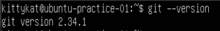
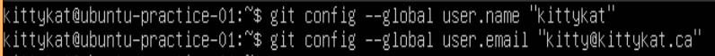
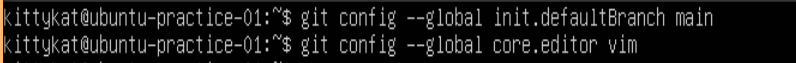
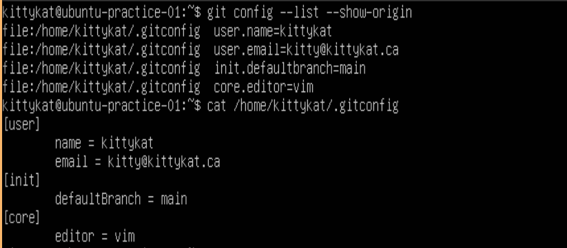

# Introduction To Git Part 1

Git is a version control system. 

## Initial Setup

### Install Git

First we need to check if Git is installed and if not install it. The following will show the version of Git if it is install.

```
git --version
```



If Git is not installed, you can install it on APT managed linux systems with the following.

```
sudo apt update && sudo apt install git
```

On DNF managed linux systems you can install Git using:

```
sudo dnf install git
```

### Configure Global Identity Information


```
git config --global user.name "first_name last_name"
git config --global user.email "example@email.ex"
```



### Configure other basic defaults

``` 
git config --global init.defaultBranch main
git config --global core.editor vim
```



### Check Git Setting

To check the configuration setting we just made and where they are stored.

```
git config --list --show-origin
```



## Getting Help

Before we go further a very useful command is the help command. The syntax is `git help <command>`. For example, to get help and learn about `git config` commands you can enter:

```
git help config
```

For a more concise reminder of command option you can use

```
git config -h
```

## Initialize A Repository

First make or navigate to the folder you wish to monitor with git. This folder will become a Git "repository".

```
mkdir my-git-repo
ls
cd my-git-repo
touch test{1,2,3,4,5,6,7,8,9}.txt
ls
pwd
```

To initialize Git on the folder you are in

```
git init
```

### Check The Status Of Git On Your New Repository

If you had files in the folder you should see them as untracked files.

```
ls
git status
```

## Add Files To A Repository For Tracking

### Start Tracking Existing Files

To start tracking the all files you currently have in the folder containing your Git repository.

```
git add --all
git status
```

Notice the files are now track and are staged to be commited.

### Add a README.md 

A README.md file describes the repository. 

```
echo "This is a example repository for learning the basic commands of Git" >> README.md
git status
git add README.md
git status
```

## Commit Changes

### Initial Commit

Preform an initial commit for your new repository. This will be the starting point of your version control.

```
git commit -m "Initial project version"
```

### Commit History

View the commit you just made. You can use this to view a history commits for the repository.

```
git log
```

## Create A Branch

### Create and Move To A New branch

Check the status of git again. Notice we are on the main branch.

```
git status
```

Create a new branch and move to that branch

```
git branch my-new-branch
git branch
git checkout my-new-branch
git branch
git status
```

### Make Changes To The New Branch

Create some new files and make changes to exiting files.


```
echo "branch test" >> test1.txt
cat test1.txt
touch newFileOnBranch
ls
git status
git add --all
git status
git branch
git commit -m "Commiting test changes to new branch"
```

### Notice The Differences Between Branchs

```
git branch
ls
grep -iR "branch test" .
git checkout main
git branch
ls
grep -iR "branch test" .
git status
```

## Merge A branch

### Create Non-Conflicting Changes On Main

Let's make a change to main which doesn't conflict with the changes on "my-new-branch" for demonstration purposes.

```
git branch
echo "non-conflicting change on main" >> test2.txt
cat test2.txt
git status
git add test2.txt
git commit -m "Created a change on main for demo-ing a non-conflicting merge"
git status
```

Let's double check the change didn't affect "my-new-branch"

```
git checkout my-new-branch
grep -iR "non-conflicting change" .
cat test2.txt
```

### Merge Non-conflicting Branchs

Since "my-new-branch" was a direct child of main and no conflicting changes were made to main we can do a simple "Fast-forward" merge. Make sure we are on main, and then merge "my-new-branch" with main.

```
git checkout main
git branch
git merge my-new-branch -m "practice merge of non-conflicting branches"
```

Notice both changes are now part of main.

```
cat test1.txt
cat test2.txt
```

## Delete An Unused Branch

Since we've just merged "my-new-branch" with "main" we no longer need "my-new-branch". Let's delete it.

```
git branch -d my-new-branch
git branch
```

## Merge Conflicting Branchs

Let's create a change on main and a new branch "my-second-branch" which conflict and see what happens when we try to merge the two branchs.

### Create A New Branch

```
git branch my-second-branch
git branch
```

### Create A Change On Main

Note: we are skipping the staging environment.

```
echo "conflict on main" >> test3.txt
cat test3.txt
git commit -a -m "Created change on main to conflict with a change on my-second-branch"
git status
```

### Create A Change On "my-second-branch"

Create a new branch, make a change, and commit the change.

```
git checkout my-second-branch
echo "conflict on my-second-branch" >> test3.txt
cat test3.txt
git commit -a -m "Created change on my-second-branch to conflict with change on main"
git status
git checkout main
git status
```

### Attempt to Merger The Conflicting Branchs

```
git merge my-second-branch -m "Merging conflicting branchs"
git status
```

Notice git alerts you of the conflicts and asks to resolve the conflict before merging can continue.

### Fix The Conflict

Look for the diff and bring the branchs into agreement.

```
echo "Fixed conflict" > test3.txt
cat test3.txt
git add test3.txt
git status
git commit -m "Fixed merge conflict"
git status
```

# Introduction To Git Part 2

## Working With A Remote Repository

For this we are going to GitHub. Create a GitHub account. Once you have created a GitHub account, create a new repository. Name the repository "tutorial-test-repo" and keep the defaults for now.

### Push A Local Repository To GitHub 

```
git remote add origin git@github.com:106106/tutorial-test-repo.git
git branch -M main
git push -u origin main
```

### Fetch Changes From GitHub

Edit test4.txt on GitHub. 

Now Fetch updates for your local git from GitHub.

```
git fetch origin
git status
git log origin
git diff origin
```

### Merge Updates To Local Repository

We can think of the local and remote repositories as just branches, so now that we've confirmed there are updates we want from the remote repository in our local repository we can merge the two.

```
git merge origin
git status
```

### Pull A Repository To Local

`pull` is a combination of `fetch` and `merge`. Make another change on GitHub to test4.txt. Now in one step we pull the change to our local repository.

```
git status
git pull origin
git status
```

### Push Changes To A Remote Repository

Make changes to test5.txt in the local repository.

```
git status
git push origin
git status
```


# References

1. GitHub
2. https://git-scm.com/book/en/v2
3. https://www.w3schools.com/git/
